# Enterprise Unified Data Platform — Azure Data Engineering Capstone

**Assignment Type:** Real-Time Azure Data Engineering Capstone Project  
**Industry Domain:** Retail and E-Commerce  
**Project Duration:** 16 Weeks  
**Team Size:** 8 Members  
**Cloud Platform:** Microsoft Azure  

---

## Table of Contents

1. [Project Overview](#1-project-overview)
2. [Architecture Overview](#2-architecture-overview)
3. [Data Sources](#3-data-sources)
4. [Unified Source Platform Design](#4-unified-source-platform-design)
5. [Azure Data Factory Orchestration](#5-azure-data-factory-orchestration)
6. [Azure Databricks Implementation](#6-azure-databricks-implementation)
7. [Medallion Architecture](#7-medallion-architecture)
8. [Delta Lake Implementation](#8-delta-lake-implementation)
9. [Data Quality Framework](#9-data-quality-framework)
10. [Power BI Consumption Layer](#10-power-bi-consumption-layer)
11. [Security Implementation](#11-security-implementation)
12. [Monitoring and Logging](#12-monitoring-and-logging)
13. [CI/CD Implementation](#13-cicd-implementation)
14. [Real-Time Scenarios and Solutions](#14-real-time-scenarios-and-solutions)
15. [Project Deliverables](#15-project-deliverables)
16. [Expected Project Outcomes](#16-expected-project-outcomes)
17. [Assignment Tasks and Work Breakdown](#17-assignment-tasks-and-work-breakdown)
18. [16-Week Implementation Timeline](#18-16-week-implementation-timeline)
19. [Team Roles (8 Members)](#19-team-roles-8-members)
20. [Repository and Project Folder Structure](#20-repository-and-project-folder-structure)
21. [ADLS Gen2 — Complete Folder and File Structure](#21-adls-gen2--complete-folder-and-file-structure)
22. [Control and Metadata Tables (Full Schemas)](#22-control-and-metadata-tables-full-schemas)
23. [Source System Table Schemas (OLTP / API)](#23-source-system-table-schemas-oltp--api)
24. [Bronze Layer — Delta Table Schemas](#24-bronze-layer--delta-table-schemas)
25. [Silver Layer — Delta Table Schemas](#25-silver-layer--delta-table-schemas)
26. [Gold Layer — Star Schema (Full Column Lists)](#26-gold-layer--star-schema-full-column-lists)
27. [Full Azure Data Factory Pipelines (Retail)](#27-full-azure-data-factory-pipelines-retail)
28. [Full Databricks Jobs and Notebooks (Retail)](#28-full-databricks-jobs-and-notebooks-retail)
29. [End-to-End Pipeline — Table-Level Lineage](#29-end-to-end-pipeline--table-level-lineage)
30. [Power BI — Semantic Model and File Mapping](#30-power-bi--semantic-model-and-file-mapping)
31. [DQ Rules Catalog (Table-Level)](#31-dq-rules-catalog-table-level)
- [Appendix D: Complete Platform Reference Diagram](#appendix-d-complete-platform-reference-diagram)
- [Appendix E: Document Revision History](#appendix-e-document-revision-history)

> **Note:** This document (v3.0) includes **Part II granular specs**: repo/ADLS folder trees, file formats, table-level schemas, and **full ADF/Databricks pipeline builds** for the retail project. Render Mermaid in VS Code, GitHub, or Cursor preview.

---

## 1. Project Overview

### Section Summary

This capstone addresses a **retail and e-commerce** enterprise that cannot scale analytics on fragmented systems. Over **16 weeks**, an **8-member team** builds a production-style **Azure lakehouse** that ingests five heterogeneous sources, applies **Medallion Architecture**, governs data with **Unity Catalog** and **Key Vault**, and exposes KPIs through **Power BI**. The sections below translate business pain into measurable technical outcomes.

### 1.1 Description

#### 1.1.1 Executive Context

Modern retail organizations operate dozens of applications that each capture a slice of the customer journey—point-of-sale transactions in **SQL Server**, inventory and GL balances in **Oracle ERP**, digital catalog and profile updates through **REST APIs**, supplier master files on **SFTP**, and behavioral signals in **MongoDB**. Without a unified platform, analysts spend more time reconciling spreadsheets than interpreting trends. Leadership lacks a **single version of truth** for revenue, inventory, and customer lifetime value.

#### 1.1.2 Technical Solution Narrative

The organization faces challenges consolidating data from multiple heterogeneous systems—including **ERP**, **CRM**, **REST APIs**, **flat files**, and **operational databases**. The business requires a **scalable, enterprise-grade unified data platform** capable of:

- Ingesting large-scale **structured** and **semi-structured** data
- Processing data through governed transformation layers
- Supporting **batch** and **near real-time** analytics
- Delivering self-service reporting via cloud-native Azure services

The solution implements a **Unified Lakehouse Data Platform** using **Medallion Architecture** (Bronze → Silver → Gold), orchestrated by **Azure Data Factory**, processed in **Azure Databricks** with **Delta Lake** on **ADLS Gen2**, and consumed through **Power BI**.

#### 1.1.3 Project Metadata Table

| Attribute | Value | Notes |
|-----------|-------|-------|
| Assignment title | Enterprise Unified Data Platform | ADF + Databricks + Delta + Power BI |
| Assignment type | Real-Time Azure Data Engineering Capstone | Includes near-RT API and streaming paths |
| Industry domain | Retail and E-Commerce | Sales, inventory, customer analytics |
| Duration | 16 weeks | See [Section 18](#18-16-week-implementation-timeline) |
| Team size | 8 members | See [Section 19](#19-team-roles-8-members) |
| Cloud platform | Microsoft Azure | PaaS-first, managed services |

#### 1.1.4 Stakeholder Matrix

| Stakeholder | Primary Need | Platform Capability |
|-------------|--------------|---------------------|
| C-suite / Finance | Revenue, margin, growth KPIs | Gold layer + Executive Sales Dashboard |
| Operations / Supply Chain | Stock levels, aging, warehouse use | FactInventory + Inventory Dashboard |
| Marketing / CRM | Segmentation, retention, patterns | DimCustomer SCD2 + Customer Insights |
| Data Engineering | Reliable pipelines, observability | ADF orchestration, audit logs, monitoring |
| IT Security | Least privilege, encryption, audit | Key Vault, RBAC, private endpoints |
| Store Managers | Regional performance (RLS) | Power BI row-level security by region |

#### 1.1.5 Business Problem → Solution Flow

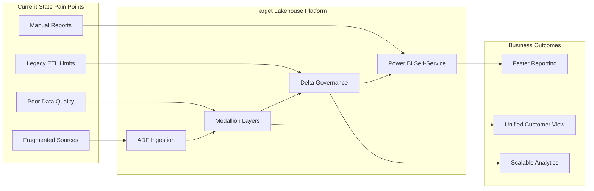

### 1.2 Business Problem

Retail enterprises in this scenario experience **operational friction** at every reporting cycle. Data producers work in silos; data consumers cannot trust consolidated numbers. The table below maps each stated business problem to its **business impact** and the **platform capability** that resolves it.

| # | Problem Statement |
|---|-------------------|
| 1 | Data scattered across multiple disconnected systems |
| 2 | No centralized analytics platform |
| 3 | Delayed business reporting and stale KPIs |
| 4 | Poor data quality and duplicate records |
| 5 | Manual, error-prone report generation |
| 6 | Lack of unified customer and sales view |
| 7 | Difficulty scaling legacy on-premises ETL systems |

#### 1.2.1 Problem Impact Analysis

| # | Problem | Business Impact | Risk if Unaddressed | Platform Remedy |
|---|---------|-----------------|---------------------|-----------------|
| 1 | Data scattered across systems | Conflicting KPIs in meetings | Wrong strategic decisions | Central ADLS + metadata ingestion |
| 2 | No centralized analytics | High cost per report | Analyst burnout, backlog | Lakehouse + Power BI |
| 3 | Delayed reporting | Missed promotional windows | Revenue leakage | Incremental + near-RT loads |
| 4 | Poor quality / duplicates | Customer trust erosion | Compliance exposure | Silver dedup + DQ framework |
| 5 | Manual report generation | 40+ hours/week manual work | Human error in board packs | Automated Gold + refresh |
| 6 | No unified customer view | Failed cross-sell campaigns | Churn | Silver conformed DimCustomer |
| 7 | Legacy ETL cannot scale | Peak season batch overruns | SLA breaches | Autoscaling Databricks |

#### 1.2.2 As-Is vs To-Be Process Flow

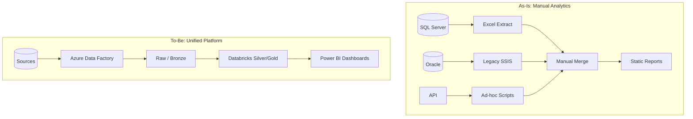

### 1.3 Business Objectives

Each objective below is **measurable** at project close. Success criteria should be validated in UAT (Week 15) and signed off by business sponsors.

| Objective | Success Criteria | KPI / Metric | Owner |
|-----------|------------------|--------------|-------|
| Build centralized enterprise data lake platform | Single ADLS Gen2 lakehouse with medallion layers | 100% critical sources landing in ADLS | Data Architect |
| Enable scalable cloud-based analytics | Databricks autoscaling clusters, Delta optimization | Cluster scales 2–8 workers under load | Databricks Lead |
| Implement automated ETL orchestration | Metadata-driven ADF pipelines with scheduling | ≥ 90% tables ingested without custom pipeline | ADF Lead |
| Improve reporting accuracy and performance | Gold star schema + Power BI incremental refresh | < 2% variance vs source control totals | BI Developer |
| Reduce data processing time | Incremental loads, MERGE, partition pruning | 50%+ runtime reduction vs legacy baseline | Data Engineer |
| Provide self-service dashboards | Role-based Power BI dashboards for business users | 3 dashboards live with RLS | BI Developer |
| Ensure data governance and security | Unity Catalog, Key Vault, RBAC, private endpoints | Zero hardcoded secrets in repo | DevOps Engineer |

#### 1.3.1 Objective Dependency Diagram

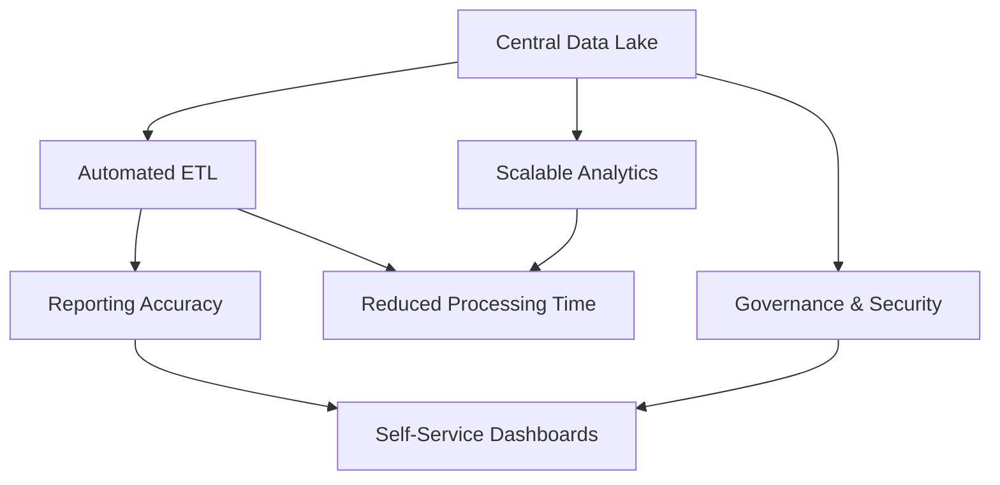

#### 1.3.2 Narrative: Why These Objectives Matter

**Centralization** eliminates the “which spreadsheet is correct?” debate by landing all authoritative sources in **ADLS Gen2** with consistent folder conventions. **Automation** through metadata-driven ADF means onboarding a new SQL table is a metadata insert, not a three-week pipeline project. **Governance** ensures that when regulators or auditors ask who accessed customer PII, Unity Catalog and audit tables provide an evidence trail. Together, objectives convert the capstone from a technical demo into an **enterprise asset** the business can operate after handover.

---

## 2. Architecture Overview

### Section Summary

The **Unified Lakehouse Data Platform** combines the low-cost storage of a data lake with the reliability and structure of a warehouse. **Azure Data Factory** orchestrates ingestion; **Databricks** executes transformations; **Delta Lake** provides ACID guarantees; **Power BI** serves curated datasets. This section defines components, diagrams, and the canonical end-to-end flow used in all downstream design decisions.

### 2.1 Architecture Name and Pattern

| Attribute | Value |
|-----------|-------|
| **Architecture Name** | Unified Lakehouse Data Platform |
| **Architecture Pattern** | Medallion Architecture (Bronze / Silver / Gold) |
| **Lake Format** | Delta Lake on ADLS Gen2 |
| **Orchestration** | Azure Data Factory |
| **Processing Engine** | Azure Databricks (Spark) |
| **Consumption** | Power BI (Direct Lake / Import / DirectQuery) |

### 2.2 Core Components

| Component | Role in Platform |
|-----------|------------------|
| **Azure Data Factory (ADF)** | Enterprise orchestration, metadata-driven ingestion, API/SFTP/batch loads |
| **Azure Databricks** | Spark-based Bronze/Silver/Gold transformations, data quality, SCD |
| **Azure Data Lake Storage Gen2** | Central storage for raw, bronze, silver, gold, archive, logs, metadata |
| **Delta Lake** | ACID tables, schema evolution, MERGE, time travel, optimization |
| **Azure Key Vault** | Secrets, connection strings, API keys |
| **Azure DevOps** | CI/CD, ARM deployment, Databricks Asset Bundles |
| **Power BI** | Executive and operational dashboards |
| **Unity Catalog** | Data governance, lineage, access control on Databricks |
| **Azure Monitor** | Platform-wide metrics, alerts, Log Analytics integration |

### 2.3 High-Level Architecture Diagram (Textual)

```
┌─────────────────────────────────────────────────────────────────────────────┐
│                           DATA SOURCES (RETAIL)                              │
├──────────┬──────────┬──────────┬──────────┬──────────────────────────────┤
│ SQL      │ Oracle   │ REST API │ SFTP     │ MongoDB (Reviews/Clickstream)  │
│ Server   │ ERP      │ JSON     │ CSV      │ Semi-Structured / Streaming    │
└────┬─────┴────┬─────┴────┬─────┴────┬─────┴──────────────┬───────────────┘
     │          │          │          │                    │
     └──────────┴──────────┴──────────┴────────────────────┘
                              │
                    ┌─────────▼─────────┐
                    │  Azure Data Factory │
                    │  - Metadata-driven  │
                    │  - API incremental  │
                    │  - Audit logging    │
                    └─────────┬───────────┘
                              │ Land to Raw / Bronze
                    ┌─────────▼─────────┐
                    │   ADLS Gen2        │
                    │ raw | bronze |     │
                    │ silver | gold |    │
                    │ archive | logs     │
                    └─────────┬───────────┘
                              │
                    ┌─────────▼─────────┐
                    │ Azure Databricks   │
                    │ NB_Bronze → Silver │
                    │ → Gold + DQ        │
                    │ Delta Lake Tables  │
                    └─────────┬───────────┘
                              │
                    ┌─────────▼─────────┐
                    │     Power BI       │
                    │ Dashboards + RLS   │
                    └────────────────────┘

     Security: Key Vault | Managed Identity | AAD | Private Endpoints
     Monitor: Azure Monitor | ADF | Databricks | Log Analytics
     CI/CD: Azure DevOps | ARM | Databricks Asset Bundles
```

### 2.4 End-to-End Data Flow

The platform follows a **unidirectional** data flow from sources to consumption. Reprocessing and backfills are supported via Delta time travel and metadata watermarks without breaking downstream dashboards.

| Step | Layer / Service | Action | Output |
|------|-----------------|--------|--------|
| 1 | ADF | Read metadata; extract from sources | Files in **Raw** |
| 2 | ADF | Validate nulls, counts, schema | Pass/fail + audit row |
| 3 | Databricks | Bronze load with lineage columns | **Bronze Delta** tables |
| 4 | Databricks | Silver cleanse, dedup, SCD | **Silver Delta** entities |
| 5 | Databricks | Gold star schema + KPIs | **Gold Delta** facts/dims |
| 6 | Power BI | Import / DirectQuery / incremental refresh | Dashboards |
| 7 | Monitor + DQ | Logs, quarantine, alerts | Operational visibility |

#### 2.4.1 End-to-End Sequence Diagram

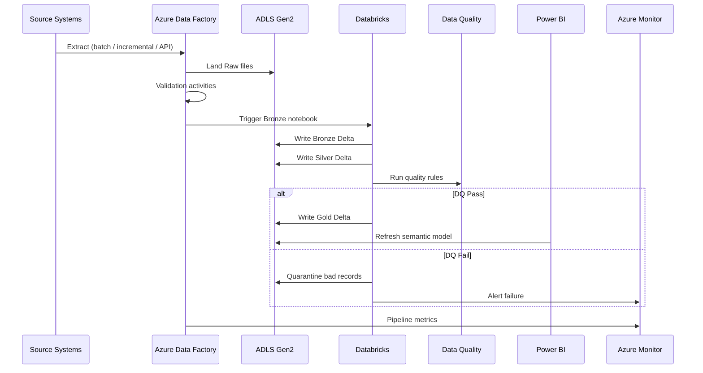

#### 2.4.2 Medallion Layer Flow

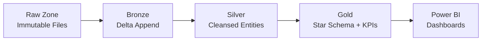

#### 2.4.3 Cross-Cutting Concerns

| Concern | Where Applied | Tools |
|---------|---------------|-------|
| Security | All layers | Key Vault, MI, RBAC, private link |
| Orchestration | Ingest + trigger transform | ADF pipelines, triggers |
| Governance | Silver/Gold | Unity Catalog, column masks |
| Quality | Post-Silver, pre-Gold | NB_Data_Quality_Checks |
| Observability | Every pipeline run | ADF Monitor, Log Analytics |

### 2.5 Technology Stack Detail

| Layer | Technology | Version / SKU | Responsibility |
|-------|------------|---------------|----------------|
| Ingestion | Azure Data Factory v2 | GA | Orchestration, copy, API, SFTP |
| Storage | ADLS Gen2 | Standard or Premium | Physical files + Delta |
| Processing | Azure Databricks | Runtime 14.x | Spark transformations |
| Table format | Delta Lake | Bundled in DBR | ACID, MERGE, time travel |
| Catalog | Unity Catalog | Workspace metastore | ACLs, lineage |
| Secrets | Azure Key Vault | Standard tier | Credentials, API keys |
| BI | Power BI Premium or PPU | Latest | Dashboards, RLS |
| DevOps | Azure DevOps | YAML pipelines | CI/CD |
| Monitor | Azure Monitor + Log Analytics | Per workspace | Alerts, workbooks |

### 2.6 Component Interaction Matrix

| From \ To | ADF | ADLS | Databricks | Key Vault | Power BI | Monitor |
|-----------|-----|------|------------|-----------|----------|---------|
| **ADF** | — | Write Raw/Bronze | Notebook activity | Read secrets | — | Emit logs |
| **ADLS** | Read/Write | — | Mount / abfss | — | Data source | Metrics |
| **Databricks** | Callback optional | Read/Write Delta | — | Secret scope | SQL endpoint | Job metrics |
| **Power BI** | — | Read Gold | Databricks SQL | — | — | Refresh status |

---

## 3. Data Sources

### Section Summary

Five source systems feed the lakehouse with **different velocities, formats, and business meaning**. A successful design respects each source’s native characteristics while landing data in a **common Raw envelope** so Bronze processing stays uniform. This section inventories sources, defines extraction parameters, and provides per-source flow diagrams.

### 3.1 Source Inventory

| Source ID | Name | Purpose | Data Type | Load Type | ADF Linked Service |
|-----------|------|---------|-----------|-----------|-------------------|
| Source_1 | **SQL Server** | Sales transactions and order management | Structured | Incremental | `LS_SQLServer` |
| Source_2 | **Oracle ERP** | Inventory and finance data | Structured | Incremental | `LS_Oracle` |
| Source_3 | **REST API** | Customer and product catalog | JSON | Near Real-Time | `LS_REST_API` |
| Source_4 | **CSV via SFTP** | Vendor and supplier uploads | Flat Files | Daily Batch | `LS_SFTP` |
| Source_5 | **MongoDB** | Customer reviews and clickstream | Semi-Structured | Streaming | `LS_MongoDB` |

### 3.2 Source-Specific Design Notes

#### Source 1: SQL Server (Incremental)

SQL Server holds **transactional sales and order** data—the highest-volume structured source in retail. Incremental extraction minimizes load on OLTP systems during business hours.

| Attribute | Detail |
|-----------|--------|
| **Watermark column** | `ModifiedDate`, `LastUpdated`, or CDC `__$start_lsn` |
| **ADF pattern** | Metadata Lookup → parameterized Copy with `WHERE watermark > @last_load` |
| **Target path** | `/raw/sqlserver/{table}/yyyy/mm/dd/` |
| **Typical tables** | `sales_orders`, `order_line_items`, `payments` |
| **Frequency** | Hourly or nightly incremental |
| **Failure mode** | Schema drift → Delta `mergeSchema` + ADF dynamic mapping |

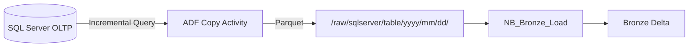

#### Source 2: Oracle ERP (Incremental)

Oracle ERP provides **inventory positions, finance postings, and supplier invoices**. Finance tables are often large; partition pruning and fiscal-period filters are essential.

| Attribute | Detail |
|-----------|--------|
| **Tables** | `INV_ONHAND`, `GL_JOURNAL`, `AP_INVOICES` (examples) |
| **Connection** | `LS_Oracle` + Key Vault service account |
| **Partitioning** | `BUSINESS_DATE` or fiscal period column |
| **Frequency** | Nightly incremental; full reload quarterly for dims |
| **Latency target** | T+1 for finance close support |

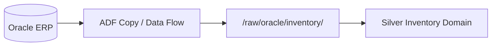

#### Source 3: REST API (Near Real-Time)

Customer and product catalog APIs change frequently; near-real-time ingestion keeps digital channels aligned with analytics.

| Attribute | Detail |
|-----------|--------|
| **Pipeline** | `PL_API_Incremental_Load` |
| **Activities** | Web Activity, Until (pagination), Copy |
| **Schedule** | Tumbling window every 5–15 minutes |
| **Auth** | OAuth token or API key from Key Vault |
| **Landing** | JSON in Raw → Bronze with `ingestion_timestamp` |

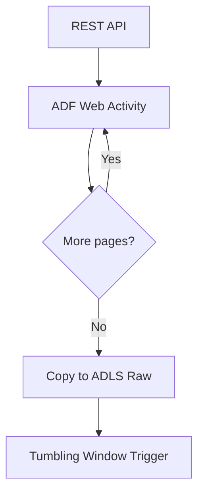

#### Source 4: CSV via SFTP (Daily Batch)

Suppliers upload **vendor master and price lists** as CSV. Batch validation prevents partial files from corrupting Silver.

| Attribute | Detail |
|-----------|--------|
| **Schedule** | Daily 05:00 UTC (example) |
| **Validation** | File exists, header match, row count ± threshold |
| **Archive** | Move to `/archive/sftp/{yyyy}/{mm}/` after success |
| **Delimiter / encoding** | Configured in dataset; UTF-8 assumed |

#### Source 5: MongoDB (Streaming)

Reviews and **clickstream** events are semi-structured and high-velocity—ideal for streaming or micro-batch patterns.

| Attribute | Detail |
|-----------|--------|
| **Pattern** | Change stream export or scheduled micro-batch |
| **Use cases** | Sentiment scores, funnel drop-off, product affinity |
| **Scale-out** | Event Hubs + Structured Streaming in production |
| **Silver output** | `silver.customer.reviews`, `silver.digital.clickstream` |

### 3.3 Source Comparison Master Table

| Dimension | SQL Server | Oracle ERP | REST API | SFTP CSV | MongoDB |
|-----------|------------|------------|----------|----------|---------|
| Structure | Relational | Relational | JSON | Flat file | BSON / JSON |
| Velocity | Batch / incremental | Batch / incremental | Near real-time | Daily | Streaming |
| Volume (est.) | High | Medium–High | Medium | Low–Medium | Very High |
| Primary domain | Sales | Inventory / Finance | Customer / Product | Supplier | Digital / CX |
| Linked service | LS_SQLServer | LS_Oracle | LS_REST_API | LS_SFTP | LS_MongoDB |
| Criticality | Critical | Critical | High | Medium | High |

### 3.4 Enterprise Source-to-Consumption Lineage

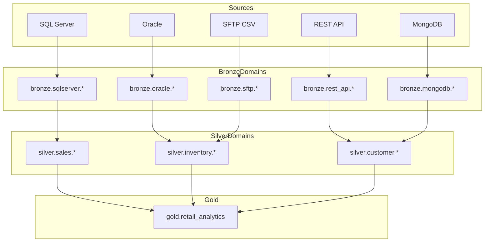

---

## 4. Unified Source Platform Design

### Section Summary

The **Unified Source Platform** is the foundation that makes multi-source ingestion maintainable. Instead of dozens of hard-coded pipelines, a **metadata control plane** drives dynamic execution. ADLS containers enforce **physical separation** of lifecycle stages (raw → gold), while audit and archive containers support compliance and troubleshooting.

### 4.1 Objective

Create a **centralized ingestion framework** capable of handling multiple source systems **dynamically**—driven by a metadata table rather than one-off pipelines per table.

### 4.2 Storage Account: ADLS Gen2

#### Containers

| Container | Purpose |
|-----------|---------|
| `raw` | Immutable landing zone from sources (files/parquet/json) |
| `bronze` | Delta tables—raw ingestion with minimal transformation |
| `silver` | Cleansed, conformed, deduplicated business entities |
| `gold` | Dimensional models and KPI aggregates for analytics |
| `archive` | Processed source files and historical snapshots |
| `logs` | Pipeline execution logs, audit trails |
| `metadata` | Control tables, watermarks, pipeline configuration |

#### Folder Structure

```
/raw/{source_name}/{table_name}/yyyy/mm/dd/
/bronze/{source_name}/{table_name}/
/silver/{domain_name}/{table_name}/
/gold/{business_domain}/
/archive/{source_name}/{yyyy}/{mm}/
/logs/pipeline_logs/{pipeline_name}/{run_id}/
/metadata/control_tables/
```

**Example paths:**

```
/raw/sqlserver/sales_orders/2026/05/20/sales_orders_20260520_001.parquet
/bronze/sqlserver/sales_orders/
/silver/sales/fact_sales_line/
/gold/retail_analytics/
```

### 4.3 Metadata Framework

#### Metadata Table Schema

| Column | Data Type | Description |
|--------|-----------|-------------|
| `Source_Name` | STRING | e.g., sqlserver, oracle, rest_api |
| `Table_Name` | STRING | Source object or API entity name |
| `Load_Type` | STRING | Full, Incremental, Streaming, Near_Real_Time |
| `Watermark_Column` | STRING | Column for incremental filter (nullable for full) |
| `File_Format` | STRING | parquet, json, csv, delta |
| `Target_Path` | STRING | ADLS path template for landing |
| `Is_Active` | BOOLEAN | Enable/disable pipeline row |
| `Last_Load_Time` | TIMESTAMP | Updated after successful run |

#### Metadata Table — Sample Rows

| Source_Name | Table_Name | Load_Type | Watermark_Column | File_Format | Target_Path | Is_Active | Last_Load_Time |
|-------------|------------|-----------|------------------|-------------|-------------|-----------|----------------|
| sqlserver | sales_orders | Incremental | ModifiedDate | parquet | /raw/sqlserver/sales_orders/ | true | 2026-05-19 23:00:00 |
| oracle | inventory | Incremental | LAST_UPDATE_DATE | parquet | /raw/oracle/inventory/ | true | 2026-05-19 22:30:00 |
| rest_api | customers | Near_Real_Time | updated_at | json | /raw/rest_api/customers/ | true | 2026-05-20 08:15:00 |
| sftp | vendors | Daily_Batch | NULL | csv | /raw/sftp/vendors/ | true | 2026-05-19 06:00:00 |
| mongodb | reviews | Streaming | event_time | json | /raw/mongodb/reviews/ | true | 2026-05-20 08:20:00 |

#### Metadata Framework Benefits

| Benefit | Description | Example |
|---------|-------------|---------|
| Dynamic pipeline execution | One `PL_Metadata_Driven_Ingestion` loops all active rows | Add 20 tables without 20 pipelines |
| Schema-driven ingestion | Columns like `File_Format`, `Target_Path` drive behavior | Switch parquet → json per row |
| Centralized control | Pause loads via `Is_Active = 0` | Halt Oracle during maintenance window |
| Reusable framework | Lower TCO; faster onboarding | New store system = metadata insert |

#### 4.3.1 Metadata-Driven Ingestion Flow

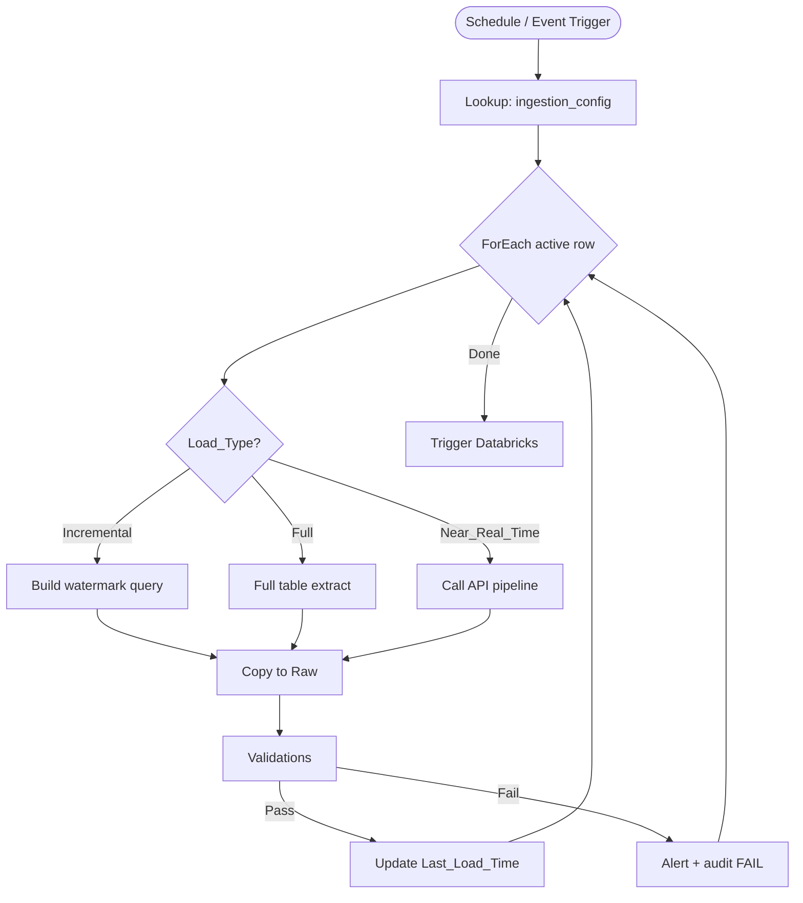

#### 4.3.2 Container Access and Lifecycle

| Container | Retention Policy | Access Role (example) | Lifecycle |
|-----------|------------------|------------------------|-----------|
| raw | 90 days hot | ADF MI: write; DBX: read | Move to archive after Bronze success |
| bronze | 1+ years | DBX: read/write | OPTIMIZE weekly |
| silver | 3+ years | DBX: read/write; analysts read via SQL | MERGE incremental |
| gold | 5+ years | BI read; DBX write | Curated, optimized for query |
| archive | 7 years (compliance) | ADF write; ops read | Cool/archive tier |
| logs | 400 days in Log Analytics | Platform ops | Immutable audit |
| metadata | Permanent | ADF + admins | Version-controlled DDL |

#### 4.3.3 Naming Conventions

| Object | Convention | Example |
|--------|------------|---------|
| Source name | lowercase, no spaces | `sqlserver`, `rest_api` |
| Table name | snake_case | `sales_orders` |
| Pipeline | `PL_{purpose}` | `PL_Metadata_Driven_Ingestion` |
| Notebook | `NB_{layer}_{action}` | `NB_Silver_Transformation` |
| Delta table | `{catalog}.{schema}.{table}` | `retail.silver.customer` |

---

## 5. Azure Data Factory Orchestration

### Section Summary

**Azure Data Factory** is the control plane for when and how data moves. It integrates hybrid sources, applies **pre-Bronze validations**, chains **Databricks jobs**, and writes **audit evidence**. This section documents linked services, datasets, pipeline internals, triggers, and failure paths in detail.

### 5.1 ADF Purpose

Use **Azure Data Factory** for enterprise **orchestration** and **workflow management**: scheduling, dependency chaining, error handling, and integration with Databricks and external systems.

### 5.2 Linked Services

| Linked Service | Connects To |
|----------------|-------------|
| `LS_SQLServer` | On-prem/cloud SQL Server (sales, orders) |
| `LS_Oracle` | Oracle ERP (inventory, finance) |
| `LS_REST_API` | Customer/product REST endpoints |
| `LS_SFTP` | Vendor CSV file drops |
| `LS_MongoDB` | Reviews and clickstream collections |
| `LS_ADLS` | ADLS Gen2 storage account |
| `LS_Databricks` | Databricks workspace (notebook jobs) |
| `LS_KeyVault` | Secrets for all connection strings |

> **Best practice:** Store passwords and API keys in Key Vault; reference via `LS_KeyVault` in ADF linked service definitions. Use **Managed Identity** for ADLS and Databricks where possible.

### 5.3 Datasets

| Dataset | Source / Sink |
|---------|---------------|
| `DS_SQLServer_Sales` | SQL Server sales tables |
| `DS_Oracle_Inventory` | Oracle inventory/finance tables |
| `DS_API_Customers` | REST API JSON responses |
| `DS_SFTP_Vendors` | SFTP CSV files |
| `DS_Mongo_Reviews` | MongoDB collections |
| `DS_ADLS_Raw` | Raw container paths |
| `DS_ADLS_Bronze` | Bronze container paths |

### 5.4 Pipeline Architecture

#### Pipeline 1: `PL_Metadata_Driven_Ingestion`

| Attribute | Detail |
|-----------|--------|
| **Purpose** | Read metadata table and dynamically ingest all active source tables |
| **Trigger** | Schedule (hourly/daily) + event-based for critical sources |

**Activities:**

| Activity | Function |
|----------|----------|
| **Lookup** | `SELECT * FROM metadata.ingestion_config WHERE Is_Active = 1` |
| **ForEach** | Iterate each metadata row |
| **If Condition** | Branch on Load_Type (Full vs Incremental vs Streaming) |
| **Copy** | Source → ADLS Raw (parameterized source/sink) |
| **Set Variable** | Capture row counts, file paths, run_id |
| **Stored Procedure** | Update `Last_Load_Time` and audit table |

**Pseudologic:**

```
Lookup(metadata_rows)
ForEach(row in metadata_rows):
  If row.Load_Type == 'Incremental':
    query = "SELECT * FROM {table} WHERE {watermark} > '{last_load}'"
  ElseIf row.Load_Type == 'Full':
    query = "SELECT * FROM {table}"
  Copy(source=row.Source, sink=row.Target_Path)
  Validate(record_count, schema)
  If validation_passed:
    Move to Bronze trigger OR mark for Databricks
  Update Last_Load_Time
```

#### 5.4.1 Pipeline 1 Activity Sequence Table

| Order | Activity Name | Type | Input | Output |
|-------|---------------|------|-------|--------|
| 1 | Lookup_Metadata | Lookup | SQL metadata table | Array of configs |
| 2 | ForEach_Source | ForEach | Lookup output | Per-item branch |
| 3 | If_Load_Type | If Condition | Load_Type field | Incremental vs Full path |
| 4 | Copy_To_Raw | Copy | Source DB/API | ADLS Raw path |
| 5 | Validate_Row_Count | Data Flow / SP | Copy output | Pass/Fail flag |
| 6 | Update_Watermark | Stored Procedure | Pass + row metadata | Updated Last_Load_Time |
| 7 | Execute_PL_Audit | Execute Pipeline | Run context | Audit row |

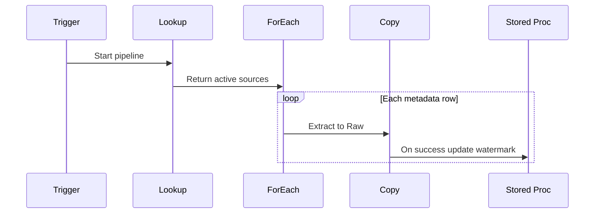

#### Pipeline 2: `PL_API_Incremental_Load`

| Attribute | Detail |
|-----------|--------|
| **Purpose** | Continuous/near real-time REST API ingestion |
| **Trigger** | Tumbling window (e.g., every 10 minutes) |

**Activities:**

| Activity | Function |
|----------|----------|
| **Web Activity** | GET/POST with auth headers from Key Vault |
| **Until** | Pagination loop until `next_page` is null |
| **Copy** | JSON response → ADLS Raw |
| **Retry policy** | Exponential backoff on 429/5xx |

#### Pipeline 3: `PL_Databricks_Transformation`

| Attribute | Detail |
|-----------|--------|
| **Purpose** | Trigger Databricks notebooks for Bronze → Silver → Gold |
| **Dependency** | Runs after successful Raw/Bronze ingestion |

**Activities:**

| Activity | Function |
|----------|----------|
| **Notebook** | `NB_Bronze_Load` → `NB_Silver_Transformation` → `NB_Gold_Aggregation` |
| **Execute Pipeline** | Optional child pipeline for domain-specific loads |
| **Wait** | Synchronize parallel domain notebooks if needed |

**Parameter passing example:**

```json
{
  "source_name": "@pipeline().parameters.source_name",
  "table_name": "@pipeline().parameters.table_name",
  "run_id": "@pipeline().RunId",
  "load_date": "@utcnow('yyyy-MM-dd')"
}
```

#### Pipeline 4: `PL_Audit_Logging`

| Attribute | Detail |
|-----------|--------|
| **Purpose** | Centralized audit and execution logs |
| **Trigger** | On completion (success/failure) of parent pipelines |

**Activities:**

| Activity | Function |
|----------|----------|
| **Stored Procedure** | Insert into `audit.pipeline_execution` |
| **Copy** | ADF diagnostic logs → `/logs/pipeline_logs/` |

### 5.5 ADF Execution Flow

The master orchestration pipeline is the **backbone** of daily operations. The numbered steps below map to activities you implement in ADF; the diagram shows branching on validation failure.

| Step | Activity | Description | On Failure |
|------|----------|-------------|------------|
| 1 | Trigger | Schedule, tumbling window, or event | Retry per policy |
| 2 | Lookup | Read `ingestion_config` | Fail pipeline; alert |
| 3 | Get Metadata / Test connection | Optional connectivity check | Skip source or fail based on SLA |
| 4 | ForEach + Copy | Extract per metadata row | Log row; continue or fail batch |
| 5 | Copy sink | Land to Raw path | Retry copy |
| 6 | Validation set | Null, count, schema checks | Route to quarantine path |
| 7 | If valid | Trigger Bronze or mark ready | — |
| 8 | Databricks Notebook | Bronze → Silver → Gold chain | Alert; no Gold refresh |
| 9 | Execute `PL_Audit_Logging` | Persist run metrics | Secondary alert |
| 10 | Logic App / Teams | Notify on-call | Ticket created |

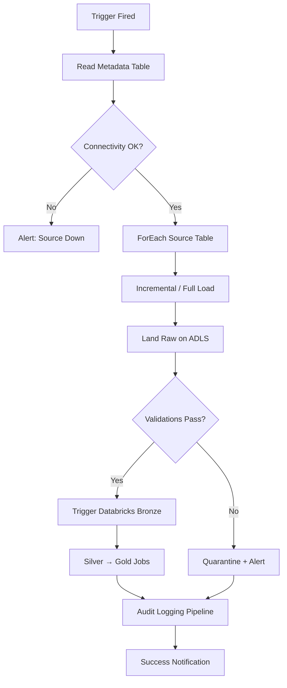

### 5.5.1 Trigger Schedule Matrix

| Pipeline | Trigger Type | Schedule (example) | Dependency |
|----------|--------------|-------------------|------------|
| PL_Metadata_Driven_Ingestion | Schedule | Daily 02:00 UTC | None |
| PL_API_Incremental_Load | Tumbling window | Every 10 minutes | None |
| PL_Databricks_Transformation | Trigger on completion | After ingestion success | Ingestion pipeline |
| PL_Audit_Logging | Execute pipeline | Always after parent | Parent pipeline |

### 5.5.2 Error Handling and Retry Policy

| Error Type | Detection | Action | Max Retries |
|------------|-----------|--------|-------------|
| Transient network | HTTP 5xx / timeout | Exponential backoff | 3 |
| Auth failure | 401 / Key Vault miss | Alert immediately; no retry | 0 |
| Schema mismatch | Validation activity | Quarantine file; continue others | 0 |
| Source empty | Row count = 0 | Warning log; skip watermark update | 0 |
| Databricks failure | Notebook exit != 0 | Fail Gold; preserve Silver | 1 |

### 5.6 ADF Validation Checks

| Validation | Implementation |
|------------|----------------|
| Null validations | Fail or quarantine if PK columns null |
| Duplicate checks | Pre-copy DISTINCT or post-load Silver dedup |
| Schema validations | Compare source vs. dataset schema; drift alert |
| File existence checks | Get Metadata activity on SFTP folder |
| Record count validation | Source COUNT vs. rows written; threshold alert |
| Data type validation | Cast checks in mapping data flow or Databricks |

#### 5.6.1 Validation Activity Flow

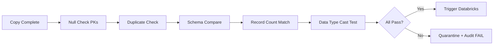

#### 5.6.2 Validation Rule Catalog (ADF Stage)

| Rule ID | Rule Name | Logic | Severity |
|---------|-----------|-------|----------|
| V001 | PK_NOT_NULL | COUNT WHERE pk IS NULL = 0 | Critical |
| V002 | ROW_COUNT_MATCH | ABS(source_cnt - sink_cnt) < threshold | Critical |
| V003 | SCHEMA_DRIFT | New columns logged; optional fail | Warning |
| V004 | FILE_EXISTS | SFTP GetMetadata count > 0 | Critical |
| V005 | DUPLICATE_SOURCE | DISTINCT pk = total rows | Warning |

---

## 6. Azure Databricks Implementation

### Section Summary

**Azure Databricks** is the distributed compute engine for all heavy transformation. Notebooks implement **Medallion** progression; job clusters provide **repeatable production runs**; Unity Catalog enforces **access boundaries**. This section specifies cluster sizing, notebook contracts, dependencies, and sample PySpark patterns.

### 6.1 Cluster Configuration

| Setting | Value |
|---------|-------|
| **Cluster Type** | Interactive (dev) + Job Clusters (prod) |
| **Node Type** | Standard_DS3_v2 (adjust per workload) |
| **Autoscaling** | Enabled (min 2, max 8 workers typical) |
| **Runtime** | Databricks Runtime 14.x (LTS) |
| **Photon** | Optional for SQL-heavy Silver/Gold |
| **Unity Catalog** | Enabled for governance |

### 6.2 Notebook Structure

| Notebook | Layer | Responsibilities |
|----------|-------|------------------|
| `NB_Bronze_Load` | Bronze | Read Raw → write Delta Bronze; add `_ingestion_time`, `_source_file` |
| `NB_Silver_Transformation` | Silver | Cleanse, dedup, join, SCD1/SCD2, business rules |
| `NB_Gold_Aggregation` | Gold | Star schema, facts/dims, KPI calculations |
| `NB_Data_Quality_Checks` | All | Great Expectations / custom rules; quarantine |
| `NB_Audit_Logging` | Cross-cutting | Write run metrics to audit Delta/SQL table |

### 6.3 Bronze Notebook — Key Logic (PySpark Outline)

```python
# Parameters: source_name, table_name, run_id, load_date
raw_path = f"abfss://raw@{storage}.dfs.core.windows.net/{source_name}/{table_name}/"
bronze_path = f"abfss://bronze@{storage}.dfs.core.windows.net/{source_name}/{table_name}/"

df = (spark.read
      .format("parquet")  # or json/csv per metadata
      .option("mergeSchema", "true")
      .load(raw_path))

df_bronze = (df
    .withColumn("_ingestion_timestamp", current_timestamp())
    .withColumn("_source_file", input_file_name())
    .withColumn("_run_id", lit(run_id)))

(df_bronze.write
    .format("delta")
    .mode("append")
    .option("mergeSchema", "true")
    .save(bronze_path))
```

### 6.4 Silver Notebook — Key Transformations

- **Deduplication:** `dropDuplicates(["natural_key"])` or `MERGE` with window `row_number()`
- **Standardization:** UPPER/TRIM on codes; phone/email regex validation
- **Joins:** Customer (API) + Sales (SQL) + Product (API)
- **SCD Type 2:** `effective_date`, `end_date`, `is_current` for `DimCustomer`
- **Incremental merge:** `deltaTable.alias("t").merge(source.alias("s"), "t.key = s.key").whenMatchedUpdateAll().whenNotMatchedInsertAll()`

### 6.5 Gold Notebook — Dimensional Model

Build **star schema** in `/gold/retail_analytics/`:

- Facts: `FactSales`, `FactOrders`, `FactInventory`
- Dimensions: `DimCustomer`, `DimProduct`, `DimStore`, `DimDate`, `DimSupplier`
- Pre-aggregate KPI tables for Power BI performance

### 6.6 Databricks Job Workflow

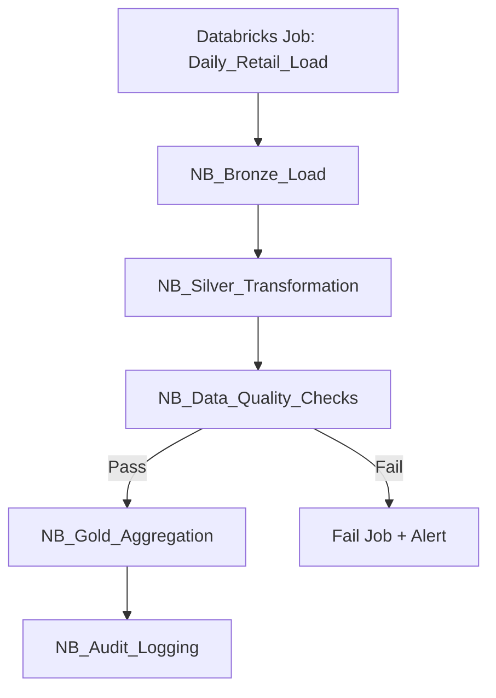

### 6.7 Cluster Sizing Guidance

| Workload | Node Type | Min Workers | Max Workers | Photon |
|----------|-----------|-------------|-------------|--------|
| Bronze ingest | Standard_DS3_v2 | 2 | 4 | Optional |
| Silver joins | Standard_DS4_v2 | 2 | 8 | Recommended |
| Gold aggregations | Standard_DS4_v2 | 2 | 6 | Recommended |
| DQ only | Standard_DS3_v2 | 1 | 2 | Off |

### 6.8 Notebook Parameter Contract

| Parameter | Type | Source | Example |
|-----------|------|--------|---------|
| source_name | string | ADF pipeline | `sqlserver` |
| table_name | string | ADF pipeline | `sales_orders` |
| run_id | string | ADF RunId | GUID |
| load_date | date | ADF utcnow | `2026-05-20` |
| environment | string | Job config | `prod` |

---

## 7. Medallion Architecture

### Section Summary

**Medallion Architecture** organizes the lakehouse into three quality zones. **Bronze** maximizes fidelity to source; **Silver** maximizes consistency across sources; **Gold** maximizes usability for BI and ML. Each layer has distinct **SLAs, transformation rules, and consumers**—documented below with diagrams and column-level examples.

### 7.1 Bronze Layer

| Attribute | Detail |
|-----------|--------|
| **Purpose** | Raw immutable ingestion layer |
| **Storage Format** | Delta Tables |
| **Immutability** | Append-only; source structure preserved |

**Activities:**

- Ingest raw source files from ADF landing zone
- Preserve source structure and column names
- Capture ingestion metadata (`_ingestion_timestamp`, `_source_file`, `_run_id`)
- Track source file names for audit
- Apply schema evolution (`mergeSchema` on write)

**Transformations (minimal):**

- Basic null handling (flag, not remove)
- Corrupt record identification (`PERMISSIVE` + `_corrupt_record`)
- Initial schema validation

**Output:** Raw Delta Tables per source/table

#### 7.1.1 Bronze Layer Attribute Table

| Attribute | Value |
|-----------|-------|
| Mutability | Append-only (corrections via new batches + MERGE only when required) |
| Schema handling | `mergeSchema = true` on write |
| Partitioning | `ingestion_date` or `source_file_date` |
| Lineage columns | `_ingestion_timestamp`, `_source_file`, `_run_id`, `_source_system` |
| Typical row count | Same as source + metadata columns |

#### 7.1.2 Bronze Processing Flow

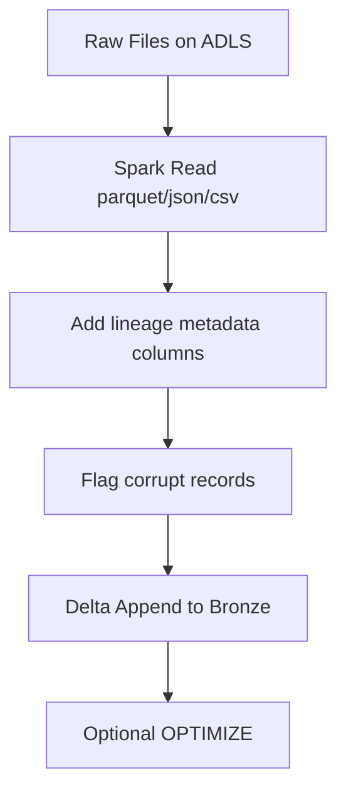

#### 7.1.3 Bronze vs Raw Comparison

| Aspect | Raw Zone | Bronze Layer |
|--------|----------|--------------|
| Format | Source-native files | Delta tables |
| Schema | File-level | Table-level with evolution |
| Purpose | Legal landing / replay | Analytics-ready immutable history |
| Query | External tables / spark read | `spark.table()` / SQL |

---

### 7.2 Silver Layer

| Attribute | Detail |
|-----------|--------|
| **Purpose** | Cleansed, conformed, business-ready entities |
| **Consumers** | Other Silver tables, Gold layer, advanced analytics |

**Activities:**

- Deduplication on business/natural keys
- Data cleansing (trim, case, invalid value replacement)
- Business rule validation (e.g., order_date ≤ ship_date)
- Data enrichment (lookup descriptions, hierarchies)
- Surrogate key generation (`monotonically_increasing_id` or hash keys)
- **SCD Type 1** — Overwrite changed attributes
- **SCD Type 2** — Historical versioning for dimensions

**Transformations:**

- Joins across SQL Server, Oracle, API, MongoDB domains
- Data standardization (currency, UOM, timezone)
- Derived columns (margin, age buckets, fiscal periods)
- Timestamp conversions to UTC
- Incremental merge logic with Delta `MERGE INTO`

**Output:** Business-ready Delta Tables (conformed dimensions and facts staging)

#### 7.2.1 Silver Entity Catalog

| Silver Table | Source Systems Joined | Grain | SCD Type |
|--------------|----------------------|-------|----------|
| silver.customer.customer | REST API + SQL | One row per customer_id | Type 2 |
| silver.sales.order_header | SQL Server | One row per order_id | Type 1 |
| silver.sales.order_line | SQL Server | One row per line_id | Type 1 |
| silver.inventory.stock | Oracle | SKU × location × day | Type 1 |
| silver.product.catalog | REST API | One row per product_id | Type 2 |
| silver.supplier.vendor | SFTP + Oracle | One row per supplier_id | Type 1 |

#### 7.2.2 SCD Type 2 Flow (DimCustomer)

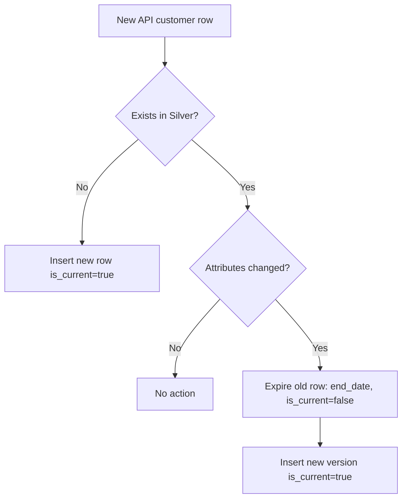

#### 7.2.3 Silver Transformation Matrix

| Transformation | Input | Output | Tooling |
|----------------|-------|--------|---------|
| Deduplication | Bronze duplicates | Latest by timestamp | `row_number()` window |
| Standardization | Mixed-case codes | UPPER/TRIM | Spark SQL |
| Join enrichment | Orders + Products | Margin column | Inner join |
| Timezone normalize | Local timestamps | UTC | `to_utc_timestamp` |
| Incremental merge | Bronze delta | Silver upsert | Delta MERGE |

---

### 7.3 Gold Layer

| Attribute | Detail |
|-----------|--------|
| **Purpose** | Analytics and reporting layer |
| **Model** | Dimensional (star schema) + KPI marts |

**Activities:**

- Star schema creation
- Fact and dimension modeling
- KPI calculations
- Business aggregations (daily, weekly, regional)
- Performance optimization (`OPTIMIZE`, Z-ORDER, partition by date)

#### Fact Tables

| Table | Grain | Key Measures |
|-------|-------|--------------|
| `FactSales` | Line item per order | Quantity, Revenue, Discount, Cost |
| `FactOrders` | Order header | Order count, Order value, fulfillment time |
| `FactInventory` | SKU × Location × Day | On-hand qty, reserved qty, stock value |

#### Dimension Tables

| Table | Type | Notes |
|-------|------|-------|
| `DimCustomer` | SCD2 | Segmentation attributes |
| `DimProduct` | SCD1/2 | Category hierarchy |
| `DimStore` | Type 1 | Region, format (online/store) |
| `DimDate` | Static | Fiscal calendar, holidays |
| `DimSupplier` | Type 1 | Vendor master from SFTP/ERP |

#### Business KPIs

| KPI | Definition (Example) |
|-----|----------------------|
| **Total Revenue** | SUM(net_sales_amount) |
| **Net Profit** | Revenue − COGS − operating costs |
| **Customer Retention** | % customers with repeat purchase in period |
| **Inventory Turnover** | COGS / Average Inventory |
| **Top Performing Regions** | RANK by revenue by region |
| **Sales Growth %** | (Current period − prior period) / prior period |

#### 7.3.1 Star Schema Diagram

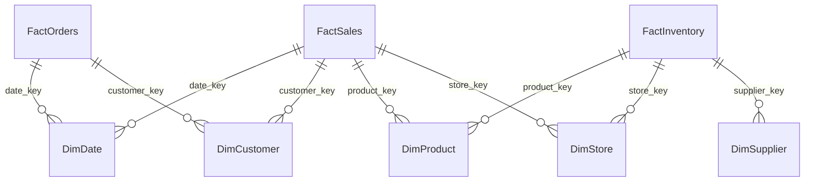

#### 7.3.2 Gold Table Column Examples

**FactSales (grain: order line)**

| Column | Type | Description |
|--------|------|-------------|
| sales_key | BIGINT | Surrogate PK |
| date_key | INT | FK to DimDate |
| customer_key | BIGINT | FK to DimCustomer |
| product_key | BIGINT | FK to DimProduct |
| store_key | INT | FK to DimStore |
| quantity | DECIMAL | Units sold |
| gross_amount | DECIMAL | Pre-discount revenue |
| discount_amount | DECIMAL | Promotions |
| net_sales_amount | DECIMAL | Revenue measure |
| cost_amount | DECIMAL | COGS for margin |

**DimCustomer (SCD2)**

| Column | Type | Description |
|--------|------|-------------|
| customer_key | BIGINT | Surrogate PK |
| customer_id | STRING | Natural key from API/SQL |
| segment | STRING | Marketing segment |
| effective_date | DATE | SCD2 start |
| end_date | DATE | SCD2 end (null if current) |
| is_current | BOOLEAN | Current version flag |

#### 7.3.3 KPI Calculation Table

| KPI | Formula | Gold Objects Used | Refresh |
|-----|---------|-------------------|---------|
| Total Revenue | SUM(net_sales_amount) | FactSales | Daily |
| Net Profit | SUM(net_sales - cost) - opex_alloc | FactSales + finance feed | Daily |
| Customer Retention | Returning customers / prior cohort | FactOrders, DimCustomer | Weekly |
| Inventory Turnover | COGS / Avg inventory value | FactInventory, FactSales | Weekly |
| Top Regions | RANK(SUM(revenue)) BY region | FactSales, DimStore | Daily |
| Sales Growth % | (CY - PY) / PY | FactSales, DimDate | Monthly |

#### 7.3.4 Gold Layer Processing Flow

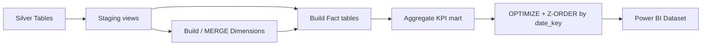

---

## 8. Delta Lake Implementation

### Section Summary

**Delta Lake** is the storage engine that turns ADLS from a file dump into a **reliable table format**. ACID transactions, schema evolution, and MERGE are not optional nice-to-haves—they are how this project achieves incremental retail loads without corrupting dashboards. This section maps Delta features to concrete retail scenarios and defines maintenance windows.

### 8.1 Features Used

| Feature | Use Case in Project |
|---------|---------------------|
| **ACID Transactions** | Reliable concurrent writes from batch and micro-batch |
| **Schema Enforcement** | Reject incompatible writes in controlled tables |
| **Schema Evolution** | Handle SQL Server schema drift without pipeline failure |
| **Time Travel** | Audit historical versions; rollback bad loads |
| **MERGE INTO** | Incremental upserts for Silver and Gold |
| **OPTIMIZE** | Compact small files post-ingestion |
| **VACUUM** | Retain policy-compliant file cleanup |

### 8.2 Use Cases

| Use Case | Implementation |
|----------|----------------|
| Incremental processing | `MERGE` on watermark / business key |
| Data versioning | `DESCRIBE HISTORY`, `VERSION AS OF` |
| Historical auditing | Time travel queries for compliance |
| Rollback capability | `RESTORE TABLE` to prior version after bad deploy |

### 8.3 MERGE Example (Silver Customer)

```sql
MERGE INTO silver.customer AS target
USING bronze.rest_api_customers AS source
ON target.customer_id = source.customer_id
WHEN MATCHED AND source.updated_at > target.updated_at THEN
  UPDATE SET *
WHEN NOT MATCHED THEN
  INSERT *
```

### 8.4 Maintenance Jobs

| Job | Frequency | Command / Action | Tables |
|-----|-----------|------------------|--------|
| OPTIMIZE | Daily | `OPTIMIZE table ZORDER BY (date_key)` | High-write Bronze, FactSales |
| VACUUM | Weekly | `VACUUM table RETAIN 168 HOURS` | All Delta tables |
| ANALYZE | Weekly | Compute statistics for optimizer | Silver, Gold |
| Partition review | Monthly | Rebalance skewed partitions | Facts > 1 TB |
| History cleanup | Per policy | Remove old versions per retention | Bronze only if approved |

#### 8.4.1 Delta Maintenance Flow

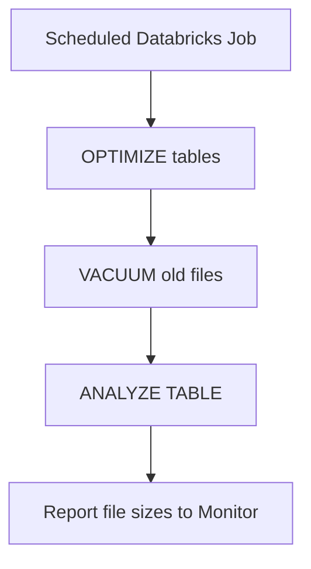

#### 8.4.2 Time Travel and Rollback Procedure

| Step | Action | Command Example |
|------|--------|-----------------|
| 1 | Identify bad version | `DESCRIBE HISTORY table` |
| 2 | Query prior state | `SELECT * FROM table VERSION AS OF 42` |
| 3 | Restore if needed | `RESTORE TABLE table TO VERSION AS OF 42` |
| 4 | Re-run downstream | Gold job from Silver watermark |

#### 8.4.3 MERGE Pattern Decision Table

| Scenario | MERGE Strategy | Match Key |
|----------|----------------|-----------|
| Customer upsert | Update if newer timestamp | customer_id |
| Order lines | Insert only (immutable) | line_id |
| Inventory snapshot | Replace partition for date | sku, location, snapshot_date |
| Product catalog SCD2 | Custom merge + expire | product_id + version |

---

## 9. Data Quality Framework

### Section Summary

Data quality is the **gate** between Silver and Gold. Without it, dashboards show revenue inflation from duplicates or null keys. The framework combines **technical rules** (uniqueness, types) with **business rules** (order date logic) and routes failures to **quarantine** with full auditability.

### 9.1 Validations

| Rule Category | Examples |
|---------------|----------|
| Primary key validation | `customer_id`, `order_id` NOT NULL and unique |
| Duplicate record checks | Window functions / group by count > 1 |
| Mandatory column checks | `email`, `product_sku`, `order_date` required |
| Null percentage threshold | Alert if > 5% null in critical columns |
| Data range validation | `quantity > 0`, `price >= 0`, `discount <= 100` |
| Date format validation | ISO-8601, valid calendar dates |
| Reference integrity | `product_id` exists in `DimProduct` |

### 9.2 Failure Handling

| Action | Description |
|--------|-------------|
| **Quarantine zone** | `/silver/quarantine/{table}/{run_id}/` for failed rows |
| **Validation reports** | Delta table `dq.validation_results` with rule, count, status |
| **Email alerts** | ADF/Databricks → Logic App on critical failures |
| **Log failed records** | Full row JSON + failure reason for remediation |

### 9.3 Data Quality Notebook Integration

`NB_Data_Quality_Checks` runs after Silver and before Gold promotion:

```
IF critical_rules_failed > 0:
  BLOCK Gold refresh
  NOTIFY data engineering + business owner
ELSE:
  PROCEED to Gold
```

#### 9.3.1 Data Quality Process Flow

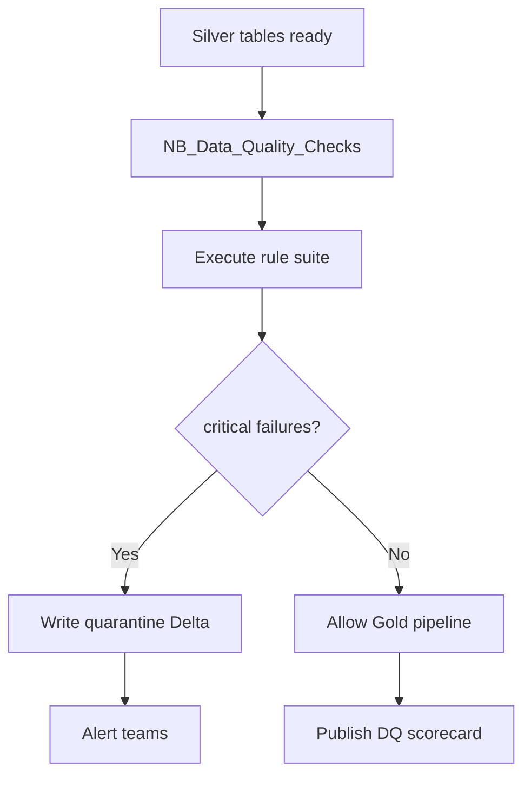

#### 9.3.2 DQ Rule Severity Matrix

| Severity | Example Rules | Action on Fail |
|----------|---------------|----------------|
| Critical | PK null, RI break on order→customer | Block Gold; page on-call |
| High | Duplicate natural keys > 0.1% | Quarantine; Gold with warning flag |
| Medium | Null % > 5% on optional fields | Log; continue |
| Low | Format warnings on phone | Log only |

#### 9.3.3 Quarantine Table Schema

| Column | Type | Description |
|--------|------|-------------|
| quarantine_id | STRING | UUID per failed row |
| source_table | STRING | Origin table |
| rule_id | STRING | e.g., V001 |
| failed_row_json | STRING | Full payload |
| failure_reason | STRING | Human-readable message |
| run_id | STRING | Pipeline run correlation |
| quarantine_ts | TIMESTAMP | When captured |

---

## 10. Power BI Consumption Layer

### Section Summary

The consumption layer is where **business value** is realized. Power BI connects to curated **Gold** tables and pre-built KPI datasets so executives and operators interact with trusted metrics—not raw Delta paths. Three dashboards align to sales, inventory, and customer domains; **RLS** enforces regional entitlements.

### 10.1 Purpose

Provide **executive** and **operational** dashboards for retail/e-commerce stakeholders with governed, performant access to Gold layer data.

### 10.2 Dashboards

#### Dashboard 1: Executive Sales Dashboard

| Visual | Data Source | Metrics |
|--------|-------------|---------|
| Revenue Trend | `FactSales` + `DimDate` | MoM/YoY line chart |
| Profit Margin | `FactSales` | (Revenue − Cost) / Revenue |
| Region-wise Sales | `DimStore` | Map or bar by region |
| Top Products | `DimProduct` | Top N by revenue |

#### Dashboard 2: Inventory Dashboard

| Visual | Data Source | Metrics |
|--------|-------------|---------|
| Stock Availability | `FactInventory` | Units on hand vs. safety stock |
| Inventory Aging | `FactInventory` + dates | Buckets: 0–30, 31–60, 60+ days |
| Warehouse Utilization | `DimStore` / warehouse | Capacity % used |

#### Dashboard 3: Customer Insights Dashboard

| Visual | Data Source | Metrics |
|--------|-------------|---------|
| Customer Segmentation | `DimCustomer` | RFM or demographic segments |
| Retention Analysis | `FactOrders` | Cohort retention curves |
| Purchase Patterns | `FactSales` | Basket analysis, frequency |

### 10.3 Power BI Features

| Feature | Application |
|---------|-------------|
| **Scheduled refresh** | Daily after Gold pipeline completes |
| **Incremental refresh** | Large fact tables partitioned by date |
| **Role-based security (RLS)** | Region/store roles on `DimStore` |
| **Drill-through reports** | Order detail from summary visuals |
| **Real-time analytics** | DirectQuery or push dataset for API near-RT KPIs |

### 10.4 Connection Modes

| Mode | When to Use |
|------|-------------|
| **Import + Incremental** | Large historical facts (best performance) |
| **Direct Lake** | Databricks SQL / OneLake (if available in environment) |
| **DirectQuery** | Near real-time operational metrics |

### 10.5 Semantic Model Architecture

```mermaid
flowchart TB
    subgraph GoldTables["Gold Delta Tables"]
        FS[FactSales]
        FO[FactOrders]
        FI[FactInventory]
        DC[DimCustomer]
        DP[DimProduct]
        DD[DimDate]
        DS[DimStore]
    end
    subgraph PBI["Power BI Model"]
        SM[Star Schema Relationships]
        M[Measures: Revenue, Margin, KPIs]
        RLS[Row-Level Security Roles]
    end
    FS --> SM
    FO --> SM
    FI --> SM
    DC --> SM
    DP --> SM
    DD --> SM
    DS --> SM
    SM --> M
    SM --> RLS
```

### 10.6 RLS Role Matrix (Example)

| Role | Filter Expression | Users |
|------|-------------------|-------|
| Region_East | `[Region] = "East"` | Regional managers East |
| Region_West | `[Region] = "West"` | Regional managers West |
| Executive_All | `TRUE()` | C-suite (no filter) |
| Store_Manager | `[StoreId] = USERPRINCIPALNAME()` | Single-store leaders |

### 10.7 Dashboard Page Layout Table

| Dashboard | Page | Visual | Chart Type | Interactivity |
|-----------|------|--------|------------|---------------|
| Executive Sales | Overview | Revenue Trend | Line | Drill to month |
| Executive Sales | Overview | Profit Margin | KPI card | Tooltip breakdown |
| Executive Sales | Products | Top Products | Bar TopN | Drill-through to SKU |
| Inventory | Stock | Availability | Gauge / bar | Filter by warehouse |
| Inventory | Aging | Aging buckets | Stacked bar | Drill to SKU list |
| Customer Insights | Segments | Segmentation | Donut / treemap | Cross-filter all pages |
| Customer Insights | Retention | Cohort | Matrix | Export friendly |

### 10.8 Refresh Strategy Detail

| Dataset | Mode | Incremental Range | Schedule |
|---------|------|-------------------|----------|
| FactSales | Import | Last 3 years; refresh 7 days | Daily 06:00 |
| DimCustomer | Import | Full | Daily 06:00 |
| DimDate | Import | Full (static) | Weekly |
| Near-RT KPI | DirectQuery | N/A | Continuous |

---

## 11. Security Implementation

### Section Summary

Security is designed **in depth**: identity at the perimeter, secrets in Key Vault, network isolation via private endpoints, and authorization through RBAC and Unity Catalog. No single control is sufficient; together they satisfy enterprise retail compliance expectations (PCI-adjacent customer data, SOX-adjacent finance feeds).

### 11.1 Authentication

| Method | Usage |
|--------|-------|
| **Managed Identity** | ADF → ADLS, ADF → Databricks, Databricks → ADLS |
| **Azure Active Directory (Entra ID)** | User access to Databricks, Power BI, DevOps |

### 11.2 Secrets Management

- All connection strings, API keys, SFTP passwords in **Azure Key Vault**
- ADF references secrets via Key Vault linked service
- No secrets in notebooks—use Databricks secret scopes backed by Key Vault

### 11.3 Security Controls

| Control | Implementation |
|---------|----------------|
| **RBAC** | Storage Blob Data Contributor scoped to containers; least privilege |
| **Storage firewall** | Allow trusted networks + managed identity bypass |
| **Private endpoints** | ADLS, Key Vault, Databricks (enterprise) |
| **Encryption at rest** | Microsoft-managed or customer-managed keys (CMK) |
| **Encryption in transit** | TLS 1.2+ for all connections |
| **Unity Catalog** | Table/column-level grants for Silver/Gold |

### 11.4 Security Architecture Diagram

```mermaid
flowchart TB
    subgraph Identity
        AAD[Azure Entra ID]
        MI[Managed Identities]
    end
    subgraph Network
        PE[Private Endpoints]
        FW[Storage Firewall]
    end
    subgraph Secrets
        KV[Azure Key Vault]
    end
    subgraph Data
        ADLS[ADLS Gen2]
        UC[Unity Catalog]
    end
    AAD --> PBI[Power BI Users]
    AAD --> DBXUsers[Databricks Users]
    MI --> ADF[ADF]
    MI --> DBX[Databricks]
    ADF --> KV
    DBX --> KV
    ADF --> ADLS
    DBX --> ADLS
    PE --> ADLS
    PE --> KV
    UC --> ADLS
```

### 11.5 RBAC Assignment Table

| Principal | Resource | Role | Scope |
|-----------|----------|------|-------|
| ADF Managed Identity | Storage Account | Storage Blob Data Contributor | raw, bronze containers |
| Databricks MI | Storage Account | Storage Blob Data Contributor | bronze, silver, gold |
| Data Engineer group | Databricks | CAN_MANAGE_RUN | Workspace jobs |
| BI Developer group | Power BI workspace | Contributor | Semantic models |
| Ops group | Log Analytics | Log Analytics Reader | Workspace |

### 11.6 Data Classification

| Data Class | Examples | Controls |
|------------|----------|----------|
| Public | DimDate, product category | Standard encryption |
| Internal | Aggregated sales | RBAC, workspace access |
| Confidential | Customer PII, email | RLS, column masking, private link |
| Restricted | Payment tokens if present | Block from Bronze; tokenize at source |

---

## 12. Monitoring and Logging

### Section Summary

Observability ensures the platform is **operable**, not just buildable. Metrics span **ADF pipeline health**, **Databricks performance**, **API latency**, **DQ failure rates**, and **Power BI refresh status**. Alerts route to on-call engineers before business users discover stale dashboards Monday morning.

### 12.1 Monitoring Tools

| Tool | Scope |
|------|-------|
| **Azure Monitor** | Infrastructure metrics, alert rules |
| **Log Analytics** | Centralized KQL queries across services |
| **Databricks Monitoring** | Cluster metrics, job duration, task failures |
| **ADF Monitoring** | Pipeline runs, activity failures, trigger history |

### 12.2 Monitored Metrics

| Metric | Threshold Example |
|--------|-------------------|
| Pipeline success rate | Alert if < 95% over 24h |
| Cluster CPU utilization | Scale out if sustained > 80% |
| Data processing latency | Bronze→Gold SLA: < 4 hours |
| Failed records count | Alert if quarantine > 0.1% of volume |
| API response time | Alert if p95 > 3 seconds |
| Dashboard refresh status | Alert on Power BI refresh failure |

### 12.3 Sample Alert Rule

```
ADF pipeline failed OR Databricks job failed
→ Action Group: email + Teams webhook
→ Runbook: link to Log Analytics query for run_id
```

### 12.4 Monitoring Architecture Flow

```mermaid
flowchart LR
    ADF[ADF Diagnostics] --> LA[Log Analytics Workspace]
    DBX[Databricks Metrics] --> LA
    ADLS[Storage Metrics] --> AM[Azure Monitor]
    PBI[Power BI Refresh API] --> LA
    LA --> ALERT[Alert Rules]
    ALERT --> AG[Action Group]
    AG --> EMAIL[Email]
    AG --> TEAMS[Teams Webhook]
    AG --> TICKET[ITSM Ticket]
```

### 12.5 SLA and SLO Table

| Metric | SLO Target | Measurement Window | Escalation |
|--------|------------|-------------------|------------|
| Pipeline availability | 99% success | 30 days | < 95% → manager |
| Bronze→Gold latency | < 4 hours | Per run | > 6 hours → on-call |
| API ingest lag | < 15 minutes | Hourly | > 30 min → on-call |
| PBI refresh | Complete by 07:00 local | Daily | Failure → BI + ops |
| DQ critical failures | 0 per day | Daily | Any → block release |

### 12.6 Sample KQL Queries

| Purpose | Query snippet |
|---------|---------------|
| Failed ADF runs | `ADFActivityRun \| where Status == 'Failed'` |
| Databricks job duration | `DatabricksJobs \| summarize avg(duration_s) by job_name` |
| Quarantine volume | Custom log table `DQQuarantine \| summarize count() by rule_id` |

---

## 13. CI/CD Implementation

### Section Summary

**CI/CD** moves artifacts from developer laptops into **governed environments** without manual portal clicks. ADF ARM templates, Databricks Asset Bundles, and parameter files per stage (Dev/QA/UAT/Prod) ensure the capstone is reproducible and auditable—critical for enterprise capstone grading and real operations.

### 13.1 Version Control

- **GitHub** or **Azure Repos** for ADF ARM export, Databricks notebooks, ARM/Bicep templates
- Branch strategy: `main` (prod), `release/uat`, `develop`

### 13.2 Deployment Tools

| Tool | Artifacts |
|------|-----------|
| **Azure DevOps Pipelines** | Build, test, deploy orchestration |
| **ARM Templates / Bicep** | ADF, ADLS, Key Vault, Monitor |
| **Databricks Asset Bundles** | Notebooks, jobs, cluster policies as code |

### 13.3 Deployment Stages

```
Development → QA → UAT → Production
```

| Stage | Validation |
|-------|------------|
| Development | Unit tests, sample data runs |
| QA | Integration tests, DQ rule validation |
| UAT | Business sign-off on dashboards |
| Production | Smoke test, monitor first scheduled run |

### 13.4 Pipeline Stages

1. **Code validation** — Lint JSON/ARM, notebook syntax check
2. **Unit testing** — PySpark unit tests (pytest), metadata validation
3. **Artifact creation** — ARM package, Databricks bundle `.whl` / bundle deploy
4. **Deployment** — Environment-specific parameter files
5. **Post-deployment validation** — Trigger test pipeline, verify Gold row counts

### 13.5 CI/CD Pipeline Flow

```mermaid
flowchart LR
    DEV[Developer Commit] --> BUILD[Build Stage]
    BUILD --> TEST[Unit + Lint Tests]
    TEST --> ART[Create ARM / Bundle Artifact]
    ART --> DEPLOY_DEV[Deploy Dev]
    DEPLOY_DEV --> SMOKE[Smoke Tests]
    SMOKE --> DEPLOY_QA[Deploy QA]
    DEPLOY_QA --> INT[Integration Tests]
    INT --> DEPLOY_UAT[Deploy UAT]
    DEPLOY_UAT --> APPROVE[Business Sign-off]
    APPROVE --> DEPLOY_PROD[Deploy Production]
```

### 13.6 Branch and Environment Mapping

| Git Branch | Azure Environment | Auto-Deploy | Approvers |
|------------|-------------------|-------------|-----------|
| develop | Development | Yes | None |
| release/qa | QA | Yes | Tech lead |
| release/uat | UAT | Manual gate | Architect + PM |
| main | Production | Manual gate | Architect + Sponsor |

### 13.7 Artifact Inventory

| Artifact | Tool | Path in Repo |
|----------|------|--------------|
| ADF templates | ARM export | `/adf/arm/` |
| Databricks notebooks | Asset Bundle | `/databricks/src/` |
| Infrastructure | Bicep/ARM | `/infra/` |
| Power BI | PBIP / deployment pipeline | `/powerbi/` |
| DevOps YAML | Azure Pipelines | `/pipelines/azure-pipelines.yml` |

---

## 14. Real-Time Scenarios and Solutions

### Section Summary

These scenarios reflect **production incidents** common in retail lakehouses. Each includes symptoms, root cause, remediation, and prevention—suitable for viva defense and operational runbooks.

### Scenario 1: Daily SQL Server Load Fails Due to Schema Drift

| Aspect | Detail |
|--------|--------|
| **Symptom** | ADF Copy activity fails when source adds/drops columns |
| **Root cause** | Fixed schema mapping in dataset |
| **Solution** | Enable **schema evolution** in Delta Lake (`mergeSchema` on Bronze write); use **dynamic mapping** in ADF mapping data flows or allow drift in Copy with landing to Raw first |
| **Prevention** | Schema registry in metadata table; alert on drift before Silver |

### Scenario 2: REST API Response Latency Increases

| Aspect | Detail |
|--------|--------|
| **Symptom** | API pipeline timeouts, incomplete pages |
| **Solution** | **Retry policy** (exponential backoff); **Until activity** for pagination with max iteration guard; increase timeout; cache tokens |
| **Monitoring** | Track API p95 in Log Analytics; scale trigger interval if needed |

### Scenario 3: Duplicate Customer Records in Reporting

| Aspect | Detail |
|--------|--------|
| **Symptom** | Inflated customer counts in Power BI |
| **Solution** | **Deduplication in Silver** using PySpark: latest record by `updated_at`, or `MERGE` on `customer_id` |
| **Prevention** | DQ rule: unique constraint on `customer_id` before Gold promotion |

### Scenario 4: Power BI Dashboard Refresh Becomes Slow

| Aspect | Detail |
|--------|--------|
| **Symptom** | Refresh exceeds SLA (> 30 min) |
| **Solution** | **Aggregation tables** in Gold (pre-summed daily sales); **incremental refresh** on date partition; reduce import columns; use composite models |
| **Prevention** | `OPTIMIZE` + Z-ORDER on fact date keys; narrow Gold tables for BI |

### 14.5 Incident Response Flow (Generic)

```mermaid
flowchart TD
    INC[Incident Detected] --> TRIAGE[Triage severity]
    TRIAGE --> P1{P1 Critical?}
    P1 -->|Yes| WAR[War room + rollback]
    P1 -->|No| FIX[Fix forward in Dev]
    WAR --> RT[Restore Delta version if needed]
    FIX --> CI[CI/CD hotfix branch]
    RT --> VAL[Validate Gold counts]
    CI --> VAL
    VAL --> CLOSE[Post-incident review]
```

### 14.6 Scenario Comparison Table

| Scenario | Layer Affected | Mean Time to Detect | Mean Time to Recover | Primary Tool |
|----------|----------------|---------------------|----------------------|--------------|
| Schema drift | Bronze/ADF | < 1 hour (failed pipeline) | 2–4 hours | Delta mergeSchema |
| API latency | ADF/API | 10–15 min | 1 hour | Retry + Until |
| Duplicate customers | Silver/Gold | 1 day (report anomaly) | 4–8 hours | Silver MERGE |
| Slow PBI refresh | Gold/PBI | 1 day | 1–2 days | Aggregates + incremental |

---

## 15. Project Deliverables

### Section Summary

Deliverables are the **evidence package** for capstone completion: working pipelines, notebooks, dashboards, automation, and documentation. Each item below should be demo-ready in Week 16 with a traceable link from source to dashboard.

| # | Deliverable | Description |
|---|-------------|-------------|
| 1 | **Architecture Diagram** | End-to-end Visio/draw.io: sources → ADF → ADLS → Databricks → Power BI |
| 2 | **ADF Pipelines** | Metadata-driven ingestion, API load, Databricks trigger, audit |
| 3 | **Databricks Notebooks** | Bronze, Silver, Gold, DQ, Audit (5 notebooks) |
| 4 | **Delta Tables** | All medallion layers with MERGE and maintenance scripts |
| 5 | **Power BI Dashboards** | Executive Sales, Inventory, Customer Insights |
| 6 | **CI/CD Pipelines** | Azure DevOps YAML, ARM, Databricks bundles |
| 7 | **Data Quality Framework** | Rules, quarantine, validation reports |
| 8 | **Monitoring Dashboards** | Azure Monitor workbook, ADF/Databricks alerts |
| 9 | **Project Documentation** | Runbooks, data dictionary, operational procedures |

### 15.1 Deliverable Acceptance Checklist

| Deliverable | Acceptance Test | Evidence |
|-------------|-----------------|----------|
| Architecture diagram | All 5 sources + security shown | PDF/Visio in `/docs` |
| ADF pipelines | Successful metadata run for 3+ sources | Monitor screenshot + run_id |
| Databricks notebooks | Job completes Bronze→Gold | Job run URL |
| Delta tables | `DESCRIBE HISTORY` shows versions | Notebook output |
| Power BI | 3 dashboards refresh | Workspace publish link |
| CI/CD | Deploy to Dev from `develop` | Pipeline green build |
| DQ framework | Quarantine populated on test bad row | Delta table sample |
| Monitoring | Alert fires on forced failure | Action group email |
| Documentation | Data dictionary ≥ 20 columns documented | Markdown/PDF |

### 15.2 Deliverable Dependency Flow

```mermaid
flowchart TD
    D1[Architecture] --> D2[ADF Ingestion]
    D2 --> D4[Delta Tables / Bronze]
    D4 --> D3[Databricks Notebooks]
    D3 --> D7[Data Quality]
    D7 --> D5[Power BI]
    D3 --> D8[Monitoring]
    D2 --> D8
    D6[CI/CD] --> D2
    D6 --> D3
    D9[Documentation] --> D1
    D9 --> D5
```

---

## 16. Expected Project Outcomes

### Section Summary

Outcomes articulate **measurable business and technical value** after go-live. They should be presented to sponsors with before/after metrics captured during UAT.

| Outcome | Measurement |
|---------|-------------|
| Unified enterprise data platform | Single lakehouse on ADLS Gen2 |
| Improved reporting efficiency | Automated refresh; no manual Excel extracts |
| Reduced ETL execution time | 50%+ reduction vs. legacy (target) |
| Scalable cloud-native architecture | Autoscaling Databricks, partitioned Delta |
| Centralized governance and monitoring | Unity Catalog + audit logs + alerts |
| Near real-time business insights | API/Mongo paths with sub-hour latency to Silver |

### 16.1 Benefits Realization Table

| Benefit Category | Before Platform | After Platform | Measurement Method |
|------------------|-----------------|----------------|-------------------|
| Report generation time | 2–3 days manual | < 1 hour automated | Time study |
| Data freshness | T+2 or worse | T+0 / near-RT for digital | Timestamp diff |
| Duplicate customer rate | Unknown / high | < 0.1% in Gold | DQ rule V005 |
| ETL runtime | 8 hours legacy | < 4 hours target | Pipeline duration logs |
| Self-service adoption | Low | 3 dashboards, 50+ users | PBI usage metrics |

### 16.2 Outcome Tracking Dashboard (Conceptual)

| KPI | Baseline | Target | Actual (UAT) | Status |
|-----|----------|--------|--------------|--------|
| Pipeline success rate | 85% | 99% | TBD | Not started |
| Gold refresh by 07:00 | 60% | 100% | TBD | Not started |
| Revenue report variance | 5% | < 2% | TBD | Not started |

---

## 17. Assignment Tasks and Work Breakdown

### Section Summary

Eight assignment tasks map directly to capstone rubric criteria. The work breakdown assigns **ownership** across the 8-person team and defines **acceptance tests** graders can execute without ambiguity.

### 17.1 Core Assignment Tasks

| Task | Activities | Owner Suggestion |
|------|------------|------------------|
| **1. Design complete architecture diagram** | HLD/LLD, network, security zones, data flow | Solution Architect |
| **2. Create metadata-driven ingestion pipelines** | Metadata table, `PL_Metadata_Driven_Ingestion`, linked services | ADF Lead |
| **3. Implement Bronze, Silver, Gold layers** | ADLS structure, 5 Databricks notebooks, Delta tables | Databricks Lead |
| **4. Build Delta Lake transformations** | MERGE, SCD, OPTIMIZE, time travel tests | Data Engineer |
| **5. Develop Power BI dashboards** | Semantic model, 3 dashboards, RLS | BI Developer |
| **6. Implement monitoring and alerting** | Azure Monitor, ADF alerts, DQ notifications | DevOps Engineer |
| **7. Configure CI/CD pipelines** | DevOps YAML, ARM, bundle deploy | DevOps Engineer |
| **8. Document all workflows and validations** | Runbooks, data dictionary, test cases | Tech Writer / All |

### 17.2 Acceptance Criteria (Per Task)

**Task 1 — Architecture**
- [ ] Diagram shows all 5 sources, ADF, ADLS containers, Databricks, Power BI
- [ ] Security and monitoring components documented

**Task 2 — Metadata Ingestion**
- [ ] Single pipeline ingests ≥ 3 sources from metadata table
- [ ] Watermark updated on success; audit row written

**Task 3 — Medallion Layers**
- [ ] Bronze: append Delta with ingestion columns
- [ ] Silver: dedup + at least one SCD2 dimension
- [ ] Gold: star schema with 3 facts and 5 dimensions

**Task 4 — Delta Lake**
- [ ] Demonstrate MERGE, time travel, OPTIMIZE in documentation or notebook

**Task 5 — Power BI**
- [ ] Three dashboards published with scheduled refresh

**Task 6 — Monitoring**
- [ ] Alert on pipeline failure; dashboard for success rate

**Task 7 — CI/CD**
- [ ] Deploy from `develop` to Dev environment via pipeline

**Task 8 — Documentation**
- [ ] Data dictionary for Gold tables; operational runbook

### 17.3 Task Dependency Gantt (Conceptual)

```mermaid
gantt
    title 16-Week Capstone Task Timeline
    dateFormat YYYY-MM-DD
    section Design
    Architecture           :a1, 2026-01-01, 14d
    section Ingestion
    Metadata ADF           :a2, after a1, 28d
    section Transform
    Bronze Silver Gold     :a3, after a2, 28d
    section Consume
    Power BI Dashboards    :a4, after a3, 14d
    section Operate
    Security Monitor CICD  :a5, after a3, 21d
```

### 17.4 Risk Register (Sample)

| Risk | Probability | Impact | Mitigation |
|------|-------------|--------|------------|
| Source access delays | High | High | Mock data + synthetic CSV Week 3 |
| Schema drift in SQL | Medium | High | Bronze mergeSchema + alerts |
| Cluster cost overrun | Medium | Medium | Job clusters; auto-terminate |
| Team skill gap in SCD2 | Medium | Medium | Pair programming; template notebook |

---

## 18. 16-Week Implementation Timeline

### Section Summary

The timeline sequences **foundation before consumption**: you cannot demo Power BI credibly until Gold exists. Weeks 13–16 harden security, monitoring, CI/CD, and hand over runbooks to operations.

| Week | Phase | Focus |
|------|-------|-------|
| 1–2 | **Initiation & Design** | Requirements, architecture, ADLS setup, metadata model |
| 3–4 | **Foundation** | Key Vault, linked services, Raw/Bronze paths, SQL + Oracle ingest |
| 5–6 | **Ingestion Expansion** | API, SFTP, MongoDB pipelines; audit logging |
| 7–8 | **Bronze & Silver** | Databricks Bronze/Silver notebooks, dedup, SCD |
| 9–10 | **Gold & DQ** | Star schema, KPIs, data quality framework, quarantine |
| 11–12 | **Power BI** | Semantic model, dashboards, RLS, incremental refresh |
| 13–14 | **Security & Monitoring** | Private endpoints, alerts, monitoring workbooks |
| 15 | **CI/CD & UAT** | DevOps pipelines, UAT with business users |
| 16 | **Production & Handover** | Prod deploy, documentation, knowledge transfer |

### 18.1 Phase Gate Criteria

| Gate | Week | Entry Criteria | Exit Criteria |
|------|------|----------------|---------------|
| G0 Initiation | 2 | Charter signed | HLD approved |
| G1 Ingestion | 6 | ADLS + ADF linked services | 3 sources ingesting to Raw |
| G2 Medallion | 10 | Bronze/Silver notebooks | Gold star schema populated |
| G3 Consumption | 12 | Gold stable | 3 PBI dashboards UAT |
| G4 Production | 16 | Security review passed | Prod smoke test green |

### 18.2 Weekly Deliverable Map

```mermaid
flowchart LR
    W12[Weeks 1-2 Design] --> W34[Weeks 3-4 SQL+Oracle]
    W34 --> W56[Weeks 5-6 API+SFTP+Mongo]
    W56 --> W78[Weeks 7-8 Bronze+Silver]
    W78 --> W910[Weeks 9-10 Gold+DQ]
    W910 --> W1112[Weeks 11-12 Power BI]
    W1112 --> W1314[Weeks 13-14 Security+Monitor]
    W1314 --> W1516[Weeks 15-16 CI/CD+Prod]
```

### 18.3 Sprint Ceremonies (Agile Overlay)

| Ceremony | Frequency | Participants | Output |
|----------|-----------|--------------|--------|
| Sprint planning | Bi-weekly | Full team | Sprint backlog |
| Daily standup | Daily 15 min | Full team | Blockers log |
| Demo | End of sprint | Team + sponsor | Working increment |
| Retrospective | Bi-weekly | Full team | Process improvements |

---

## 19. Team Roles (8 Members)

### Section Summary

Eight roles cover **delivery, architecture, build, and operations**. Overlap is expected—ADF developers pair with Databricks engineers on metadata contracts; DevOps enables everyone via CI/CD and Key Vault.

| Role | Responsibilities |
|------|------------------|
| **Project Manager** | Timeline, stakeholders, RAID log |
| **Solution / Data Architect** | HLD, medallion standards, technology decisions |
| **ADF Developer (×2)** | Pipelines, datasets, triggers, metadata framework |
| **Databricks Data Engineer (×2)** | Bronze/Silver/Gold, Delta, PySpark, performance |
| **BI Developer** | Power BI model, dashboards, RLS |
| **DevOps / Cloud Engineer** | CI/CD, ARM, security, monitoring, Key Vault |

### 19.1 RACI Matrix (Sample)

| Activity | PM | Architect | ADF×2 | DBX×2 | BI | DevOps |
|----------|----|-----------|-------|-------|----|--------|
| HLD sign-off | A | R | C | C | I | C |
| Metadata framework | I | A | R | C | I | I |
| Gold star schema | I | A | I | R | C | I |
| Power BI dashboards | I | C | I | C | R | I |
| Prod deployment | A | C | C | C | C | R |

*R = Responsible, A = Accountable, C = Consulted, I = Informed*

### 19.2 Team Communication Flow

```mermaid
flowchart TB
    PM[Project Manager] --> ARCH[Solution Architect]
    ARCH --> ADF[ADF Developers]
    ARCH --> DBX[Databricks Engineers]
    ADF --> DBX
    DBX --> BI[BI Developer]
    DEVOPS[DevOps] --> ADF
    DEVOPS --> DBX
    DEVOPS --> BI
    PM --> SPONSOR[Business Sponsor]
    BI --> SPONSOR
```

---

## Appendix A: Audit Table Schema (Suggested)

### Purpose

The audit table provides a **single query surface** for operations teams to answer: *What ran, when, for which source, and did it succeed?* Correlate `run_id` across ADF, Databricks, and DQ quarantine tables during incident response.

```sql
CREATE TABLE audit.pipeline_execution (
  run_id           STRING,
  pipeline_name    STRING,
  source_name      STRING,
  table_name       STRING,
  start_time       TIMESTAMP,
  end_time         TIMESTAMP,
  status           STRING,  -- SUCCESS | FAILED
  rows_read        BIGINT,
  rows_written     BIGINT,
  error_message    STRING
)
USING DELTA
LOCATION 'abfss://logs@{storage}.dfs.core.windows.net/audit/pipeline_execution/'
```

---

## Appendix B: Glossary

| Term | Definition | Used In Section |
|------|------------|-----------------|
| **Medallion Architecture** | Layered data design: Bronze (raw), Silver (cleansed), Gold (analytics) | §7 |
| **Delta Lake** | Open-source storage layer bringing ACID to data lakes | §8 |
| **Watermark** | Column tracking last successful incremental extract | §4, §5 |
| **SCD** | Slowly Changing Dimension—Type 1 overwrite, Type 2 history | §7.2 |
| **Metadata-driven** | Pipelines configured by control tables, not hard-coded per object | §4, §5 |
| **Lakehouse** | Data lake flexibility + warehouse structure and performance | §2 |
| **ADLS Gen2** | Azure Data Lake Storage with hierarchical namespace | §4 |
| **Unity Catalog** | Databricks governance layer for tables, lineage, ACLs | §2, §11 |
| **MERGE INTO** | Delta upsert pattern for incremental loads | §8 |
| **RLS** | Row-Level Security in Power BI restricting visible rows | §10 |
| **Tumbling window** | ADF trigger firing fixed intervals for API loads | §5 |
| **Quarantine** | Isolated zone for records failing DQ rules | §9 |
| **ForEach** | ADF activity iterating array from Lookup | §5 |
| **Fact table** | Transactional measurements at defined grain | §7.3 |
| **Dimension table** | Descriptive attributes for filtering/grouping | §7.3 |
| **Photon** | Databricks native vectorized engine for SQL workloads | §6 |
| **Asset Bundle** | Databricks CI/CD package for jobs and notebooks | §13 |

---

## Appendix C: Reference Links

- [Azure Data Factory documentation](https://learn.microsoft.com/en-us/azure/data-factory/)
- [Azure Databricks documentation](https://learn.microsoft.com/en-us/azure/databricks/)
- [Delta Lake documentation](https://docs.delta.io/)
- [Medallion architecture](https://learn.microsoft.com/en-us/azure/databricks/lakehouse/medallion)
- [Power BI documentation](https://learn.microsoft.com/en-us/power-bi/)

---

## Appendix D: Complete Platform Reference Diagram

```mermaid
flowchart TB
    subgraph SRC["Sources"]
        SQL[(SQL Server)]
        ORA[(Oracle ERP)]
        API[REST API]
        SFTP[SFTP CSV]
        MONGO[(MongoDB)]
    end
    subgraph ORCH["Orchestration - Azure Data Factory"]
        META[Metadata Table]
        PL1[PL_Metadata_Driven_Ingestion]
        PL2[PL_API_Incremental_Load]
        PL3[PL_Databricks_Transformation]
        PL4[PL_Audit_Logging]
    end
    subgraph STORE["ADLS Gen2 Medallion"]
        RAW[raw]
        BRZ[bronze Delta]
        SLV[silver Delta]
        GLD[gold Delta]
    end
    subgraph COMPUTE["Azure Databricks"]
        NB1[NB_Bronze_Load]
        NB2[NB_Silver_Transformation]
        NB3[NB_Data_Quality_Checks]
        NB4[NB_Gold_Aggregation]
    end
    subgraph SEC["Security & Ops"]
        KV[Key Vault]
        UC[Unity Catalog]
        MON[Azure Monitor]
    end
    subgraph BI["Power BI"]
        D1[Executive Sales]
        D2[Inventory]
        D3[Customer Insights]
    end
    SQL & ORA & API & SFTP & MONGO --> PL1
    API --> PL2
    META --> PL1
    PL1 --> RAW
    PL2 --> RAW
    RAW --> NB1 --> BRZ
    BRZ --> NB2 --> SLV
    SLV --> NB3
    NB3 --> NB4 --> GLD
    PL1 --> PL3
    PL3 --> NB1
    PL1 & PL3 --> PL4
    KV --> ORCH
    UC --> COMPUTE
    GLD --> D1 & D2 & D3
    ORCH & COMPUTE --> MON
```

---

# PART II — Granular Implementation Specification (Retail)

This part documents **every folder, file, format, table schema, and pipeline activity** at implementation depth. Use it as the build blueprint for the retail capstone.

## 20. Repository and Project Folder Structure

### 20.1 Git Monorepo Layout

```
retail-lakehouse-platform/
├── README.md
├── .gitignore
├── docs/
│   ├── architecture/
│   │   ├── HLD-Retail-Lakehouse.drawio
│   │   └── LLD-Data-Flows.md
│   ├── data-dictionary/
│   │   ├── gold-tables.md
│   │   └── source-systems.md
│   └── runbooks/
│       ├── pipeline-restart.md
│       └── schema-drift-playbook.md
├── infra/
│   ├── bicep/
│   │   ├── main.bicep
│   │   ├── modules/
│   │   │   ├── storage.bicep          # ADLS Gen2 + containers
│   │   │   ├── keyvault.bicep
│   │   │   ├── datafactory.bicep
│   │   │   └── monitor.bicep
│   │   └── parameters/
│   │       ├── dev.parameters.json
│   │       ├── qa.parameters.json
│   │       ├── uat.parameters.json
│   │       └── prod.parameters.json
│   └── arm/                            # ADF export fallback
│       └── adf/
├── adf/
│   ├── factory/
│   │   └── adf-retail-prod.json
│   ├── linkedService/
│   │   ├── LS_SQLServer.json
│   │   ├── LS_Oracle.json
│   │   ├── LS_REST_API.json
│   │   ├── LS_SFTP.json
│   │   ├── LS_MongoDB.json
│   │   ├── LS_ADLS.json
│   │   ├── LS_Databricks.json
│   │   └── LS_KeyVault.json
│   ├── dataset/
│   │   ├── DS_SQLServer_Sales.json
│   │   ├── DS_Oracle_Inventory.json
│   │   ├── DS_API_Customers.json
│   │   ├── DS_SFTP_Vendors.json
│   │   ├── DS_Mongo_Reviews.json
│   │   ├── DS_ADLS_Raw.json
│   │   └── DS_ADLS_Bronze.json
│   ├── pipeline/
│   │   ├── PL_Metadata_Driven_Ingestion.json
│   │   ├── PL_API_Incremental_Load.json
│   │   ├── PL_Databricks_Transformation.json
│   │   ├── PL_Audit_Logging.json
│   │   ├── PL_SQLServer_Sales_Incremental.json    # child optional
│   │   └── PL_Master_Daily_Orchestration.json     # parent wrapper
│   ├── trigger/
│   │   ├── TR_Daily_0200_UTC.json
│   │   ├── TR_API_Tumbling_10min.json
│   │   └── TR_Event_SFTP_FileArrival.json
│   └── integrationRuntime/
│       └── IR-SelfHosted-Retail.json              # if on-prem SQL/Oracle
├── databricks/
│   ├── databricks.yml                               # Asset Bundle
│   ├── resources/
│   │   ├── jobs.yml
│   │   └── clusters.yml
│   └── src/
│       ├── bronze/
│       │   └── NB_Bronze_Load.py
│       ├── silver/
│       │   ├── NB_Silver_Transformation.py
│       │   ├── NB_Silver_Customer_SCD2.py
│       │   └── NB_Silver_Sales_Merge.py
│       ├── gold/
│       │   └── NB_Gold_Aggregation.py
│       ├── dq/
│       │   └── NB_Data_Quality_Checks.py
│       ├── audit/
│       │   └── NB_Audit_Logging.py
│       └── common/
│           ├── config.py
│           └── utils_delta.py
├── sql/
│   ├── metadata/
│   │   └── 001_create_ingestion_config.sql
│   ├── audit/
│   │   └── 002_create_pipeline_execution.sql
│   └── control/
│       └── 003_create_dq_rules.sql
├── powerbi/
│   ├── RetailAnalytics/
│   │   ├── RetailAnalytics.pbip
│   │   ├── ExecutiveSales.Report/
│   │   ├── Inventory.Report/
│   │   └── CustomerInsights.Report/
│   └── datasets/
│       └── Retail_Gold_Dataset.tmdl
└── pipelines/                                       # Azure DevOps YAML
    ├── azure-pipelines.yml
    ├── templates/
    │   ├── deploy-adf.yml
    │   └── deploy-databricks.yml
    └── scripts/
        ├── post-deploy-smoke.ps1
        └── validate-gold-rowcount.sql
```

### 20.2 Naming Conventions (Files and Objects)

| Object Type | Pattern | Example |
|-------------|---------|---------|
| ADF Pipeline | `PL_{Domain}_{Purpose}` | `PL_Metadata_Driven_Ingestion` |
| ADF Dataset | `DS_{Source}_{Entity}` | `DS_SQLServer_Sales` |
| ADF Linked Service | `LS_{Technology}` | `LS_Oracle` |
| ADF Trigger | `TR_{Schedule}_{Detail}` | `TR_Daily_0200_UTC` |
| Databricks Notebook | `NB_{Layer}_{Action}.py` | `NB_Gold_Aggregation.py` |
| Delta Table | `{catalog}.{schema}.{table}` | `retail_prod.gold.fact_sales` |
| Raw file | `{table}_{yyyymmdd}_{hhmmss}_{batch}.parquet` | `sales_orders_20260520_020015_001.parquet` |
| Unity Catalog schema | `bronze`, `silver`, `gold`, `dq`, `audit` | `retail_prod.silver.customer` |

---

## 21. ADLS Gen2 — Complete Folder and File Structure

### 21.1 Storage Account Layout

| Storage Account | Purpose | Containers |
|-----------------|---------|------------|
| `stretaildatalakeprod` | Production lake | raw, bronze, silver, gold, archive, logs, metadata |
| `stretaildatalakedev` | Development | Same structure, smaller retention |

### 21.2 Full Directory Tree (Production)

```
abfss://raw@stretaildatalakeprod.dfs.core.windows.net/
├── sqlserver/
│   ├── sales_orders/
│   │   └── 2026/05/20/
│   │       ├── sales_orders_20260520_020015_001.parquet
│   │       └── _SUCCESS
│   ├── order_line_items/
│   │   └── 2026/05/20/...
│   └── payments/
│       └── 2026/05/20/...
├── oracle/
│   ├── inventory_onhand/
│   │   └── 2026/05/20/...
│   ├── gl_journal/
│   │   └── 2026/05/20/...
│   └── ap_invoices/
│       └── 2026/05/20/...
├── rest_api/
│   ├── customers/
│   │   └── 2026/05/20/08/
│   │       ├── customers_page_001_20260520_081000.json
│   │       └── customers_page_002_20260520_081000.json
│   └── products/
│       └── 2026/05/20/08/...
├── sftp/
│   └── vendors/
│       └── 2026/05/20/
│           └── vendor_master_20260520.csv
└── mongodb/
    ├── reviews/
    │   └── 2026/05/20/08/
    │       └── reviews_microbatch_20260520_080500.json
    └── clickstream/
        └── 2026/05/20/08/...

abfss://bronze@stretaildatalakeprod.dfs.core.windows.net/
├── sqlserver/
│   ├── sales_orders/          # Delta table root (_delta_log/)
│   ├── order_line_items/
│   └── payments/
├── oracle/
│   ├── inventory_onhand/
│   └── gl_journal/
├── rest_api/
│   ├── customers/
│   └── products/
├── sftp/
│   └── vendors/
└── mongodb/
    ├── reviews/
    └── clickstream/

abfss://silver@stretaildatalakeprod.dfs.core.windows.net/
├── customer/
│   ├── customer/              # SCD2
│   └── customer_address/
├── sales/
│   ├── order_header/
│   └── order_line/
├── product/
│   └── product_catalog/
├── inventory/
│   └── stock_daily/
├── supplier/
│   └── vendor/
└── digital/
    ├── reviews/
    └── clickstream_session/

abfss://gold@stretaildatalakeprod.dfs.core.windows.net/
└── retail_analytics/
    ├── dimension/
    │   ├── dim_customer/
    │   ├── dim_product/
    │   ├── dim_store/
    │   ├── dim_date/
    │   └── dim_supplier/
    ├── fact/
    │   ├── fact_sales/
    │   ├── fact_orders/
    │   └── fact_inventory/
    └── mart/
        ├── mart_daily_sales_kpi/
        └── mart_inventory_kpi/

abfss://archive@stretaildatalakeprod.dfs.core.windows.net/
├── sqlserver/2026/05/
├── sftp/vendors/2026/05/
└── rest_api/customers/2026/05/

abfss://logs@stretaildatalakeprod.dfs.core.windows.net/
├── pipeline_logs/
│   ├── PL_Metadata_Driven_Ingestion/
│   │   └── run_id=8f3a2b1c-.../
│   │       └── activity_log.json
│   └── PL_API_Incremental_Load/
└── audit/
    └── pipeline_execution/    # Delta audit table

abfss://metadata@stretaildatalakeprod.dfs.core.windows.net/
└── control_tables/
    ├── ingestion_config/      # Delta or CSV bootstrap
    ├── dq_rules/
    └── schema_registry/
```

### 21.3 File Formats by Zone and Source

| Zone | Source | Landing Format | Compression | Partition Keys | Typical File Size |
|------|--------|----------------|-------------|----------------|-------------------|
| Raw | SQL Server | Parquet (Snappy) | Snappy | yyyy/mm/dd | 50–500 MB |
| Raw | Oracle | Parquet (Snappy) | Snappy | yyyy/mm/dd | 100 MB–2 GB |
| Raw | REST API | JSON (line or array) | None | yyyy/mm/dd/hh | 1–50 MB per page |
| Raw | SFTP | CSV UTF-8 | None | yyyy/mm/dd | 1–20 MB |
| Raw | MongoDB | JSON (NDJSON) | Gzip optional | yyyy/mm/dd/hh | 10–200 MB |
| Bronze | All | **Delta Lake** | ZSTD (default) | ingestion_date | N/A (table) |
| Silver | All | **Delta Lake** | ZSTD | business_date / none | N/A |
| Gold | All | **Delta Lake** | ZSTD | date_key (facts) | N/A |

### 21.4 Raw File Schema Examples

**Parquet from SQL Server (`sales_orders`)** — mirrors OLTP columns plus no metadata yet.

**JSON from REST API (`customers_page_001.json`):**

```json
{
  "data": [
    {
      "customer_id": "CUST-10001",
      "first_name": "Anita",
      "last_name": "Sharma",
      "email": "anita@example.com",
      "phone": "+1-555-0100",
      "segment": "LOYAL",
      "updated_at": "2026-05-20T08:10:00Z"
    }
  ],
  "pagination": { "page": 1, "total_pages": 5, "next_url": "/api/v1/customers?page=2" }
}
```

**CSV from SFTP (`vendor_master_20260520.csv`):**

```csv
supplier_id,supplier_name,country_code,payment_terms,active_flag,load_date
SUP-001,Acme Wholesale,US,NET30,Y,2026-05-20
SUP-002,Global Textiles,IN,NET45,Y,2026-05-20
```

---

## 22. Control and Metadata Tables (Full Schemas)

### 22.1 `metadata.control.ingestion_config`

**Physical path:** `abfss://metadata@stretaildatalakeprod.dfs.core.windows.net/control_tables/ingestion_config/`  
**Format:** Delta Lake  
**Unity Catalog:** `retail_prod.metadata.ingestion_config`

```sql
CREATE TABLE IF NOT EXISTS retail_prod.metadata.ingestion_config (
  config_id           BIGINT GENERATED ALWAYS AS IDENTITY,
  source_name         STRING NOT NULL,          -- sqlserver | oracle | rest_api | sftp | mongodb
  source_schema       STRING,                   -- dbo | APPS | api_v1
  table_name          STRING NOT NULL,
  load_type           STRING NOT NULL,          -- Full | Incremental | Daily_Batch | Near_Real_Time | Streaming
  watermark_column    STRING,
  watermark_type      STRING,                   -- datetime | int | lsn
  file_format         STRING NOT NULL,          -- parquet | json | csv
  source_query        STRING,                   -- optional override SQL
  target_container    STRING NOT NULL,          -- raw
  target_path_template STRING NOT NULL,         -- sqlserver/{table_name}/yyyy/MM/dd/
  bronze_table_path   STRING NOT NULL,
  is_active           BOOLEAN NOT NULL DEFAULT true,
  priority            INT NOT NULL DEFAULT 100,
  batch_size          INT DEFAULT 100000,
  last_load_time      TIMESTAMP,
  last_watermark_value STRING,
  last_run_id         STRING,
  last_status         STRING,                   -- SUCCESS | FAILED | RUNNING
  created_at          TIMESTAMP NOT NULL,
  updated_at          TIMESTAMP NOT NULL
)
USING DELTA
LOCATION 'abfss://metadata@stretaildatalakeprod.dfs.core.windows.net/control_tables/ingestion_config/';
```

**Seed data (retail):**

| config_id | source_name | table_name | load_type | watermark_column | file_format | target_path_template |
|-----------|-------------|------------|-----------|------------------|-------------|----------------------|
| 1 | sqlserver | sales_orders | Incremental | ModifiedDate | parquet | sqlserver/sales_orders/yyyy/MM/dd/ |
| 2 | sqlserver | order_line_items | Incremental | ModifiedDate | parquet | sqlserver/order_line_items/yyyy/MM/dd/ |
| 3 | oracle | inventory_onhand | Incremental | LAST_UPDATE_DATE | parquet | oracle/inventory_onhand/yyyy/MM/dd/ |
| 4 | rest_api | customers | Near_Real_Time | updated_at | json | rest_api/customers/yyyy/MM/dd/HH/ |
| 5 | sftp | vendors | Daily_Batch | NULL | csv | sftp/vendors/yyyy/MM/dd/ |
| 6 | mongodb | reviews | Streaming | event_time | json | mongodb/reviews/yyyy/MM/dd/HH/ |

### 22.2 `audit.pipeline_execution`

```sql
CREATE TABLE retail_prod.audit.pipeline_execution (
  run_id            STRING NOT NULL,
  pipeline_name     STRING NOT NULL,
  parent_run_id     STRING,
  source_name       STRING,
  table_name        STRING,
  activity_name     STRING,
  start_time        TIMESTAMP NOT NULL,
  end_time          TIMESTAMP,
  status            STRING NOT NULL,     -- SUCCESS | FAILED | SKIPPED
  rows_read         BIGINT,
  rows_written      BIGINT,
  rows_rejected     BIGINT,
  watermark_before  STRING,
  watermark_after   STRING,
  error_code        STRING,
  error_message     STRING,
  adf_run_url       STRING,
  databricks_run_id BIGINT
)
USING DELTA
PARTITIONED BY (days(start_time))
LOCATION 'abfss://logs@stretaildatalakeprod.dfs.core.windows.net/audit/pipeline_execution/';
```

### 22.3 `dq.rules` and `dq.validation_results`

```sql
CREATE TABLE retail_prod.dq.rules (
  rule_id           STRING NOT NULL,
  target_schema     STRING NOT NULL,
  target_table      STRING NOT NULL,
  rule_type         STRING NOT NULL,    -- PK_NOT_NULL | UNIQUE | RANGE | RI | CUSTOM_SQL
  column_name       STRING,
  rule_expression   STRING NOT NULL,
  severity          STRING NOT NULL,    -- CRITICAL | HIGH | MEDIUM | LOW
  is_active         BOOLEAN DEFAULT true
);

CREATE TABLE retail_prod.dq.validation_results (
  validation_run_id STRING NOT NULL,
  run_id            STRING NOT NULL,
  rule_id           STRING NOT NULL,
  table_name        STRING NOT NULL,
  failed_count      BIGINT,
  total_count       BIGINT,
  pass_flag         BOOLEAN,
  executed_at       TIMESTAMP
);
```

---

## 23. Source System Table Schemas (OLTP / API)

### 23.1 SQL Server — Sales Domain

#### `dbo.sales_orders` (source)

| Column | Source Type | Nullable | Notes |
|--------|-------------|----------|-------|
| order_id | BIGINT | N | PK |
| customer_id | VARCHAR(50) | N | FK to CRM/API |
| store_id | INT | N | |
| order_date | DATETIME2 | N | |
| order_status | VARCHAR(20) | N | PLACED, SHIPPED, CANCELLED |
| currency_code | CHAR(3) | N | |
| gross_amount | DECIMAL(18,2) | N | |
| discount_amount | DECIMAL(18,2) | Y | |
| tax_amount | DECIMAL(18,2) | Y | |
| net_amount | DECIMAL(18,2) | N | |
| ModifiedDate | DATETIME2 | N | **Watermark** |

#### `dbo.order_line_items` (source)

| Column | Source Type | Nullable | Notes |
|--------|-------------|----------|-------|
| line_id | BIGINT | N | PK |
| order_id | BIGINT | N | FK |
| product_sku | VARCHAR(30) | N | |
| quantity | INT | N | |
| unit_price | DECIMAL(18,2) | N | |
| line_discount | DECIMAL(18,2) | Y | |
| line_total | DECIMAL(18,2) | N | |
| ModifiedDate | DATETIME2 | N | Watermark |

### 23.2 Oracle ERP — Inventory / Finance

#### `APPS.INV_ONHAND_QTY` (source)

| Column | Source Type | Nullable | Notes |
|--------|-------------|----------|-------|
| INVENTORY_ITEM_ID | NUMBER | N | |
| ORGANIZATION_ID | NUMBER | N | Warehouse |
| SUBINVENTORY_CODE | VARCHAR2(10) | N | |
| ONHAND_QTY | NUMBER | N | |
| RESERVED_QTY | NUMBER | Y | |
| LAST_UPDATE_DATE | DATE | N | Watermark |

### 23.3 REST API — Customer / Product (logical schema)

| Column | JSON Path | Type | Notes |
|--------|-----------|------|-------|
| customer_id | $.customer_id | string | Natural key |
| first_name | $.first_name | string | |
| last_name | $.last_name | string | |
| email | $.email | string | PII |
| segment | $.segment | string | LOYAL, NEW, AT_RISK |
| updated_at | $.updated_at | timestamp | Watermark |

---

## 24. Bronze Layer — Delta Table Schemas

Bronze = **source columns + lineage metadata**. All Bronze tables use append mode with `mergeSchema=true`.

### 24.1 `retail_prod.bronze.sqlserver_sales_orders`

| Column | Spark Type | Source | Description |
|--------|------------|--------|-------------|
| order_id | LONG | SQL | PK |
| customer_id | STRING | SQL | |
| store_id | INT | SQL | |
| order_date | TIMESTAMP | SQL | |
| order_status | STRING | SQL | |
| currency_code | STRING | SQL | |
| gross_amount | DECIMAL(18,2) | SQL | |
| discount_amount | DECIMAL(18,2) | SQL | |
| tax_amount | DECIMAL(18,2) | SQL | |
| net_amount | DECIMAL(18,2) | SQL | |
| ModifiedDate | TIMESTAMP | SQL | |
| _ingestion_timestamp | TIMESTAMP | Derived | `current_timestamp()` |
| _ingestion_date | DATE | Derived | For partition |
| _source_file | STRING | Derived | `input_file_name()` |
| _run_id | STRING | Parameter | ADF pipeline run |
| _source_system | STRING | Constant | `sqlserver` |

**Path:** `abfss://bronze@stretaildatalakeprod.dfs.core.windows.net/sqlserver/sales_orders/`  
**Partition:** `_ingestion_date`  
**Write mode:** Append

### 24.2 `retail_prod.bronze.rest_api_customers`

| Column | Spark Type | Notes |
|--------|------------|-------|
| customer_id | STRING | |
| first_name | STRING | |
| last_name | STRING | |
| email | STRING | |
| phone | STRING | |
| segment | STRING | |
| updated_at | TIMESTAMP | |
| _ingestion_timestamp | TIMESTAMP | |
| _ingestion_date | DATE | |
| _source_file | STRING | |
| _run_id | STRING | |
| _source_system | STRING | `rest_api` |
| _api_page | INT | Optional from ADF |

### 24.3 Bronze Table Catalog (Retail)

| Unity Catalog Table | Source | Raw Format | Partition |
|---------------------|--------|------------|-----------|
| bronze.sqlserver_sales_orders | SQL Server | parquet | _ingestion_date |
| bronze.sqlserver_order_line_items | SQL Server | parquet | _ingestion_date |
| bronze.oracle_inventory_onhand | Oracle | parquet | _ingestion_date |
| bronze.rest_api_customers | REST API | json | _ingestion_date |
| bronze.rest_api_products | REST API | json | _ingestion_date |
| bronze.sftp_vendors | SFTP | csv | _ingestion_date |
| bronze.mongodb_reviews | MongoDB | json | _ingestion_date |
| bronze.mongodb_clickstream | MongoDB | json | _ingestion_date |

---

## 25. Silver Layer — Delta Table Schemas

### 25.1 `retail_prod.silver.sales_order_header`

| Column | Type | Constraint | Transformation from Bronze |
|--------|------|------------|----------------------------|
| order_id | BIGINT | PK | Direct |
| customer_id | STRING | NK | Trim, upper |
| store_id | INT | | Direct |
| order_date_utc | TIMESTAMP | | Convert timezone |
| order_status | STRING | | Map codes |
| net_amount | DECIMAL(18,2) | | Direct |
| is_valid_order | BOOLEAN | | `order_date <= current_date()` |
| _silver_updated_at | TIMESTAMP | | `current_timestamp()` |

**Merge key:** `order_id`  
**Dedup rule:** Latest `ModifiedDate` per `order_id`

### 25.2 `retail_prod.silver.customer` (SCD Type 2)

| Column | Type | Notes |
|--------|------|-------|
| customer_key | BIGINT | Surrogate PK |
| customer_id | STRING | Natural key |
| full_name | STRING | Derived `first_name || last_name` |
| email | STRING | Cleansed, lowercased |
| segment | STRING | |
| effective_date | DATE | SCD2 start |
| end_date | DATE | NULL if current |
| is_current | BOOLEAN | |
| _silver_updated_at | TIMESTAMP | |

### 25.3 Silver Entity Relationship

```mermaid
erDiagram
    silver_sales_order_header ||--o{ silver_sales_order_line : order_id
    silver_customer ||--o{ silver_sales_order_header : customer_id
    silver_product_catalog ||--o{ silver_sales_order_line : product_sku
    silver_inventory_stock_daily }o--|| silver_product_catalog : product_sku
```

### 25.4 Silver Table Catalog

| Table | Grain | Merge Keys | Upstream Bronze |
|-------|-------|------------|-----------------|
| silver.sales_order_header | 1 per order | order_id | bronze.sqlserver_sales_orders |
| silver.sales_order_line | 1 per line | line_id | bronze.sqlserver_order_line_items |
| silver.customer | SCD2 versions | customer_id + effective_date | bronze.rest_api_customers |
| silver.product_catalog | 1 per SKU | product_sku | bronze.rest_api_products |
| silver.inventory_stock_daily | SKU×loc×day | composite | bronze.oracle_inventory_onhand |
| silver.supplier_vendor | 1 per supplier | supplier_id | bronze.sftp_vendors |
| silver.digital_reviews | 1 per review_id | review_id | bronze.mongodb_reviews |

---

## 26. Gold Layer — Star Schema (Full Column Lists)

### 26.1 `retail_prod.gold.dim_date`

| Column | Type | Description |
|--------|------|-------------|
| date_key | INT | PK yyyymmdd |
| full_date | DATE | |
| day_of_week | INT | |
| week_of_year | INT | |
| month | INT | |
| quarter | INT | |
| year | INT | |
| fiscal_year | INT | Retail fiscal |
| fiscal_period | INT | |
| is_weekend | BOOLEAN | |
| is_holiday | BOOLEAN | |

### 26.2 `retail_prod.gold.dim_customer`

| Column | Type | Description |
|--------|------|-------------|
| customer_key | BIGINT | PK |
| customer_id | STRING | NK |
| full_name | STRING | |
| email | STRING | |
| segment | STRING | |
| region | STRING | Enriched |
| is_current | BOOLEAN | From SCD2 |
| valid_from | DATE | |
| valid_to | DATE | |

### 26.3 `retail_prod.gold.dim_product`

| Column | Type | Description |
|--------|------|-------------|
| product_key | BIGINT | PK |
| product_sku | STRING | NK |
| product_name | STRING | |
| category_l1 | STRING | |
| category_l2 | STRING | |
| brand | STRING | |
| unit_cost | DECIMAL(18,2) | |

### 26.4 `retail_prod.gold.dim_store`

| Column | Type | Description |
|--------|------|-------------|
| store_key | INT | PK |
| store_id | INT | NK |
| store_name | STRING | |
| region | STRING | RLS column |
| store_type | STRING | ONLINE, STORE |
| country | STRING | |

### 26.5 `retail_prod.gold.dim_supplier`

| Column | Type | Description |
|--------|------|-------------|
| supplier_key | INT | PK |
| supplier_id | STRING | NK |
| supplier_name | STRING | |
| country_code | STRING | |
| payment_terms | STRING | |

### 26.6 `retail_prod.gold.fact_sales` (grain: order line)

| Column | Type | FK | Measure/Degenerate |
|--------|------|----|--------------------|
| sales_key | BIGINT | PK | Surrogate |
| date_key | INT | DimDate | |
| customer_key | BIGINT | DimCustomer | |
| product_key | BIGINT | DimProduct | |
| store_key | INT | DimStore | |
| order_id | BIGINT | Degenerate | |
| line_id | BIGINT | Degenerate | |
| quantity | DECIMAL(18,4) | Measure | |
| unit_price | DECIMAL(18,2) | Measure | |
| discount_amount | DECIMAL(18,2) | Measure | |
| net_sales_amount | DECIMAL(18,2) | Measure | |
| cost_amount | DECIMAL(18,2) | Measure | |
| margin_amount | DECIMAL(18,2) | Derived | |

**Partition:** `date_key`  
**Z-ORDER:** `(customer_key, product_key)`

### 26.7 `retail_prod.gold.fact_orders` (grain: order)

| Column | Type | Description |
|--------|------|-------------|
| order_key | BIGINT | PK |
| date_key | INT | |
| customer_key | BIGINT | |
| store_key | INT | |
| order_id | BIGINT | |
| order_count | INT | Always 1 |
| order_value | DECIMAL(18,2) | |
| fulfillment_hours | DECIMAL(10,2) | |

### 26.8 `retail_prod.gold.fact_inventory` (grain: SKU × location × day)

| Column | Type | Description |
|--------|------|-------------|
| inventory_key | BIGINT | PK |
| date_key | INT | |
| product_key | BIGINT | |
| store_key | INT | |
| supplier_key | INT | |
| onhand_qty | DECIMAL(18,4) | |
| reserved_qty | DECIMAL(18,4) | |
| available_qty | DECIMAL(18,4) | Derived |
| stock_value | DECIMAL(18,2) | |

### 26.9 Gold KPI Mart — `gold.mart_daily_sales_kpi`

| Column | Type | Formula |
|--------|------|---------|
| date_key | INT | |
| region | STRING | |
| total_revenue | DECIMAL(18,2) | SUM(net_sales_amount) |
| total_orders | BIGINT | COUNT DISTINCT order_id |
| gross_margin_pct | DECIMAL(5,2) | (revenue-cost)/revenue |
| sales_growth_pct | DECIMAL(5,2) | vs prior period join |

---

## 27. Full Azure Data Factory Pipelines (Retail)

### 27.1 Pipeline Inventory

| Pipeline | Type | Trigger | Calls |
|----------|------|---------|-------|
| `PL_Master_Daily_Orchestration` | Parent | Daily 02:00 UTC | PL_Metadata, PL_Databricks, PL_Audit |
| `PL_Metadata_Driven_Ingestion` | Core ingest | From master | Child copies per metadata |
| `PL_API_Incremental_Load` | API | Tumbling 10 min | Standalone |
| `PL_Databricks_Transformation` | Transform | After ingest | 5 notebooks |
| `PL_Audit_Logging` | Audit | On completion | Stored proc + copy logs |

### 27.2 `PL_Master_Daily_Orchestration` — Full Activity List

| Seq | Activity | Type | Depends On | Parameters |
|-----|----------|------|------------|------------|
| 1 | Get_Environment | Set Variable | — | environment=prod |
| 2 | Execute_PL_Metadata_Driven_Ingestion | Execute Pipeline | — | load_date=@utcnow('yyyy-MM-dd') |
| 3 | Wait_5_Min | Wait | 2 | 5 minutes (optional buffer) |
| 4 | Execute_PL_Databricks_Transformation | Execute Pipeline | 2 Success | source_name=*, table_name=* |
| 5 | Execute_PL_Audit_Logging | Execute Pipeline | 4 Completed | parent_run_id=@pipeline().RunId |
| 6 | If_Failed_Send_Alert | Web/Logic App | 2 or 4 Failed | alert payload |

```mermaid
flowchart TD
    M[PL_Master_Daily] --> I[PL_Metadata_Driven_Ingestion]
    I -->|Success| D[PL_Databricks_Transformation]
    D --> A[PL_Audit_Logging]
    I -->|Failure| ALERT[Logic App Alert]
    D -->|Failure| ALERT
```

### 27.3 `PL_Metadata_Driven_Ingestion` — Full Build Specification

**Pipeline parameters:**

| Parameter | Type | Default | Description |
|-----------|------|---------|-------------|
| p_load_date | String | @utcnow('yyyy-MM-dd') | Business load date |
| p_environment | String | prod | dev/qa/uat/prod |
| p_max_parallel | Int | 3 | ForEach batch count |

**Variables:**

| Variable | Purpose |
|----------|---------|
| v_run_id | @pipeline().RunId |
| v_row_count | Per iteration from Copy |
| v_status | SUCCESS/FAILED |

**Activities (detailed):**

| # | Activity Name | Type | Configuration |
|---|---------------|------|---------------|
| 1 | Lookup_Ingestion_Config | Lookup | Source: Azure SQL or Delta via Databricks SQL endpoint. Query: `SELECT * FROM metadata.ingestion_config WHERE is_active = true ORDER BY priority` |
| 2 | ForEach_Source_Table | ForEach | Items: `@activity('Lookup_Ingestion_Config').output.value`, Batch count: `@pipeline().parameters.p_max_parallel` |
| 2.1 | If_Incremental | If Condition | Expression: `@equals(item().load_type,'Incremental')` |
| 2.1.1 | Copy_Incremental_SQL | Copy | Source: `@item().source_name` dataset with query: `SELECT * FROM {table} WHERE {watermark} > '@{item().last_watermark_value}'` Sink: ADLS Raw path from template |
| 2.2 | If_Full | If Condition | `load_type = Full` |
| 2.2.1 | Copy_Full | Copy | Full table extract |
| 2.3 | If_Daily_Batch | If Condition | SFTP branch |
| 2.3.1 | Get_SFTP_Metadata | Get Metadata | Validate file exists |
| 2.3.2 | Copy_SFTP_CSV | Copy | DelimitedText → Raw |
| 2.4 | Validate_Record_Count | Execute Data Flow or SP | Compare source count vs copied |
| 2.5 | If_Validation_Pass | If Condition | |
| 2.5.1 | SP_Update_Watermark | Stored Procedure | Update ingestion_config last_load_time, last_watermark_value, last_run_id |
| 2.5.2 | Set_Variable_Success | Set Variable | |
| 2.6 | If_Validation_Fail | If Condition | |
| 2.6.1 | Copy_To_Quarantine_Raw | Copy | Failed batch to raw/_quarantine/ |
| 2.6.2 | SP_Log_Audit_Fail | Stored Procedure | Insert audit.pipeline_execution FAILED |

**Copy activity sink path (dynamic):**

```
@concat('sqlserver/', item().table_name, '/', formatDateTime(utcnow(), 'yyyy/MM/dd'), '/',
        item().table_name, '_', formatDateTime(utcnow(), 'yyyyMMdd_HHmmss'), '_001.parquet')
```

### 27.4 `PL_API_Incremental_Load` — Full Build Specification

| # | Activity | Type | Detail |
|---|----------|------|--------|
| 1 | Web_Get_OAuth_Token | Web | POST token endpoint; Key Vault client_secret |
| 2 | Set_Access_Token | Set Variable | Bearer token |
| 3 | Until_No_Next_Page | Until | `@empty(variables('v_next_url'))` = true, max 100 iterations |
| 3.1 | Web_Get_Customers_Page | Web | GET `@variables('v_next_url')` |
| 3.2 | Set_Response_JSON | Set Variable | Body |
| 3.3 | Copy_JSON_To_Raw | Copy | Source: JSON from variable; Sink: `rest_api/customers/yyyy/MM/dd/HH/` |
| 3.4 | Set_Next_URL | Set Variable | Parse pagination.next_url |
| 4 | SP_Update_API_Watermark | Stored Procedure | Max updated_at from payload |

**Retry policy (all Web/Copy):** Interval 120s, count 3, exponential.

### 27.5 `PL_Databricks_Transformation` — Notebook Chain

| Order | Activity | Notebook Path | Base Parameters |
|-------|----------|---------------|-----------------|
| 1 | NB_Bronze_Load | `/Shared/retail/bronze/NB_Bronze_Load` | source_name, table_name, run_id, load_date |
| 2 | NB_Silver_Transformation | `/Shared/retail/silver/NB_Silver_Transformation` | same |
| 3 | NB_Data_Quality_Checks | `/Shared/retail/dq/NB_Data_Quality_Checks` | run_id |
| 4 | If_DQ_Pass | If Condition | `@activity('NB_Data_Quality_Checks').output.run_output.pass_flag` |
| 4.1 | NB_Gold_Aggregation | `/Shared/retail/gold/NB_Gold_Aggregation` | load_date |
| 5 | NB_Audit_Logging | `/Shared/retail/audit/NB_Audit_Logging` | run_id, status |

**Databricks linked service:** Job cluster, DBR 14.3 LTS, autoscale 2–8, `Standard_DS4_v2`.

### 27.6 ADF Dataset Parameterization

**`DS_ADLS_Raw` (parameterized):**

| Parameter | Example |
|-----------|---------|
| container | raw |
| directory | sqlserver/sales_orders/2026/05/20 |
| fileName | *.parquet |

**`DS_SQLServer_Sales`:**

| Property | Value |
|----------|-------|
| Linked service | LS_SQLServer |
| Table | dbo.sales_orders OR query parameter |

---

## 28. Full Databricks Jobs and Notebooks (Retail)

### 28.1 Job Definition — `JOB_Retail_Daily_Medallion`

| Job setting | Value |
|-------------|-------|
| Job name | JOB_Retail_Daily_Medallion |
| Schedule | 0 0 3 * * ? (03:00 UTC daily) |
| Max concurrent runs | 1 |
| Email on failure | data-ops@retail.com |

**Tasks:**

| Task key | Notebook | Depends on |
|----------|----------|------------|
| bronze_load | NB_Bronze_Load | — |
| silver_transform | NB_Silver_Transformation | bronze_load |
| dq_checks | NB_Data_Quality_Checks | silver_transform |
| gold_aggregate | NB_Gold_Aggregation | dq_checks (if pass) |
| audit_log | NB_Audit_Logging | gold_aggregate |

### 28.2 `NB_Bronze_Load.py` — Processing Logic by Table

```python
# Widgets: source_name, table_name, run_id, load_date
from pyspark.sql.functions import current_timestamp, input_file_name, lit, to_date

catalog = "retail_prod"
raw_base = f"abfss://raw@stretaildatalakeprod.dfs.core.windows.net/{source_name}/{table_name}/"
bronze_path = f"abfss://bronze@stretaildatalakeprod.dfs.core.windows.net/{source_name}/{table_name}/"

format_map = {"parquet": "parquet", "json": "json", "csv": "csv"}
fmt = dbutils.widgets.get("file_format")  # from job params / metadata

df = spark.read.format(format_map[fmt]).option("mergeSchema", "true").load(raw_base + load_date.replace("-","/"))

bronze_df = (df
  .withColumn("_ingestion_timestamp", current_timestamp())
  .withColumn("_ingestion_date", to_date("_ingestion_timestamp"))
  .withColumn("_source_file", input_file_name())
  .withColumn("_run_id", lit(run_id))
  .withColumn("_source_system", lit(source_name)))

(bronze_df.write.format("delta").mode("append")
  .option("mergeSchema", "true")
  .partitionBy("_ingestion_date")
  .save(bronze_path))

spark.sql(f"CREATE TABLE IF NOT EXISTS {catalog}.bronze.{source_name}_{table_name} USING DELTA LOCATION '{bronze_path}'")
```

### 28.3 `NB_Silver_Transformation.py` — Table-Specific MERGE (sales_orders example)

```sql
MERGE INTO retail_prod.silver.sales_order_header AS t
USING (
  SELECT order_id, trim(customer_id) AS customer_id, store_id,
         to_utc_timestamp(order_date, 'America/New_York') AS order_date_utc,
         upper(order_status) AS order_status, net_amount, ModifiedDate
  FROM (
    SELECT *, row_number() OVER (PARTITION BY order_id ORDER BY ModifiedDate DESC) rn
    FROM retail_prod.bronze.sqlserver_sales_orders
    WHERE _ingestion_date = '${load_date}'
  ) WHERE rn = 1
) AS s
ON t.order_id = s.order_id
WHEN MATCHED AND s.ModifiedDate > t._source_modified_date THEN UPDATE SET *
WHEN NOT MATCHED THEN INSERT *
```

### 28.4 `NB_Gold_Aggregation.py` — Build Order

| Step | SQL / Action | Output Table |
|------|--------------|--------------|
| 1 | Refresh dim_date from calendar CSV | gold.dim_date |
| 2 | MERGE dim_customer from silver.customer WHERE is_current | gold.dim_customer |
| 3 | MERGE dim_product from silver.product_catalog | gold.dim_product |
| 4 | INSERT OVERWRITE fact_sales from silver lines + dims | gold.fact_sales |
| 5 | INSERT OVERWRITE mart_daily_sales_kpi | gold.mart_daily_sales_kpi |
| 6 | OPTIMIZE + ZORDER fact_sales | performance |

---

## 29. End-to-End Pipeline — Table-Level Lineage

### 29.1 Sales Order Line — Full Lineage Map

```mermaid
flowchart LR
    subgraph OLTP
        SQL_SO[dbo.sales_orders]
        SQL_LI[dbo.order_line_items]
    end
    subgraph RAW
        R_SO[raw/sqlserver/sales_orders/*.parquet]
        R_LI[raw/sqlserver/order_line_items/*.parquet]
    end
    subgraph BRONZE
        B_SO[bronze.sqlserver_sales_orders]
        B_LI[bronze.sqlserver_order_line_items]
    end
    subgraph SILVER
        S_HDR[silver.sales_order_header]
        S_LINE[silver.sales_order_line]
    end
    subgraph GOLD
        F_S[fact_sales]
        D_C[dim_customer]
        D_P[dim_product]
        D_D[dim_date]
    end
    subgraph PBI
        VIS[Executive Sales Dashboard]
    end
    SQL_SO --> R_SO --> B_SO --> S_HDR
    SQL_LI --> R_LI --> B_LI --> S_LINE
    S_HDR --> F_S
    S_LINE --> F_S
    D_C --> F_S
    D_P --> F_S
    D_D --> F_S
    F_S --> VIS
```

### 29.2 Column-Level Lineage — `net_sales_amount` in `fact_sales`

| Step | Table.Column | Transformation |
|------|--------------|----------------|
| 1 | dbo.order_line_items.line_total | Source measure |
| 2 | bronze...order_line_items.line_total | Append ingest |
| 3 | silver.sales_order_line.line_total | Dedup by line_id |
| 4 | gold.fact_sales.net_sales_amount | Join dims; currency normalize |
| 5 | gold.mart_daily_sales_kpi.total_revenue | SUM(net_sales_amount) |
| 6 | Power BI measure [Total Revenue] | SUM(fact_sales[net_sales_amount]) |

### 29.3 Daily Run Timeline (Table Refresh Order)

| UTC Time | Pipeline / Job | Tables Materialized |
|----------|----------------|---------------------|
| 02:00 | PL_Master starts | — |
| 02:05–03:30 | PL_Metadata copies | raw.* daily partitions |
| 03:35 | NB_Bronze_Load | bronze.* append |
| 04:00 | NB_Silver_Transformation | silver.* MERGE |
| 04:30 | NB_Data_Quality_Checks | dq.validation_results |
| 04:45 | NB_Gold_Aggregation | gold.fact_*, gold.dim_* |
| 05:00 | NB_Audit_Logging | audit.pipeline_execution |
| 06:00 | Power BI refresh | Semantic model import |

---

## 30. Power BI — Semantic Model and File Mapping

### 30.1 Tables Imported from Gold

| PBI Table | Source Delta Table | Refresh | Incremental |
|-----------|-------------------|---------|-------------|
| FactSales | gold.fact_sales | Daily | Yes on date_key |
| FactOrders | gold.fact_orders | Daily | Yes |
| FactInventory | gold.fact_inventory | Daily | Yes |
| DimCustomer | gold.dim_customer | Daily | No (small) |
| DimProduct | gold.dim_product | Daily | No |
| DimStore | gold.dim_store | Weekly | No |
| DimDate | gold.dim_date | Weekly | No |
| MartDailyKPI | gold.mart_daily_sales_kpi | Daily | Yes |

### 30.2 Relationship Diagram (PBI)

```mermaid
erDiagram
    FactSales }o--|| DimDate : date_key
    FactSales }o--|| DimCustomer : customer_key
    FactSales }o--|| DimProduct : product_key
    FactSales }o--|| DimStore : store_key
    FactOrders }o--|| DimDate : date_key
    FactInventory }o--|| DimProduct : product_key
```

### 30.3 DAX Measures (Retail)

```dax
Total Revenue = SUM(FactSales[net_sales_amount])
Total Orders = DISTINCTCOUNT(FactSales[order_id])
Gross Margin % = DIVIDE(SUM(FactSales[margin_amount]), SUM(FactSales[net_sales_amount]))
Sales Growth % =
VAR CY = [Total Revenue]
VAR PY = CALCULATE([Total Revenue], SAMEPERIODLASTYEAR(DimDate[full_date]))
RETURN DIVIDE(CY - PY, PY)
```

---

## 31. DQ Rules Catalog (Table-Level)

| rule_id | target_table | rule_type | rule_expression | severity |
|---------|--------------|-----------|-----------------|----------|
| DQ001 | silver.sales_order_header | PK_NOT_NULL | order_id IS NOT NULL | CRITICAL |
| DQ002 | silver.sales_order_header | UNIQUE | COUNT(*) = COUNT(DISTINCT order_id) | CRITICAL |
| DQ003 | silver.sales_order_line | RANGE | quantity > 0 | HIGH |
| DQ004 | silver.customer | UNIQUE | customer_id unique where is_current | CRITICAL |
| DQ005 | gold.fact_sales | RI | customer_key exists in dim_customer | CRITICAL |
| DQ006 | gold.fact_sales | RANGE | net_sales_amount >= 0 | HIGH |

---

## Appendix E: Document Revision History

| Version | Date | Changes |
|---------|------|---------|
| 1.0 | 2026-05-20 | Initial capstone documentation |
| 2.0 | 2026-05-20 | Added flow diagrams, expanded tables and section narratives |
| 3.0 | 2026-05-20 | Part II: folder structures, full schemas, full pipelines (retail) |

---

*Document version: 3.0 | Last updated: May 20, 2026 | Capstone: Enterprise Unified Data Platform — Retail & E-Commerce*
